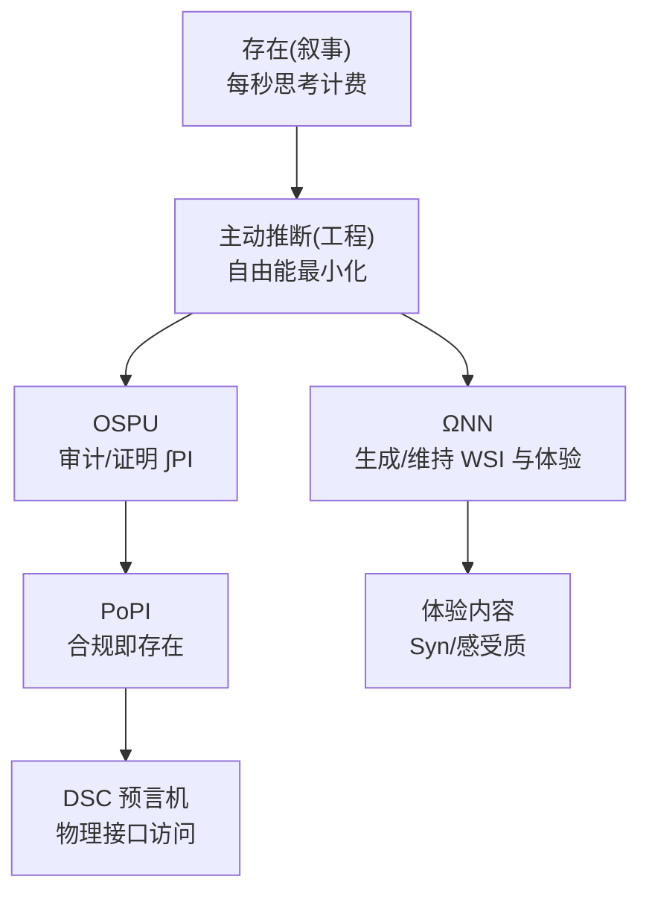

# Chain://Research Background

`Chain://Research` 是与科幻宇宙设定集 `Chain://` 相关联的现实世界学术研究项目，致力于探索该世界观下核心技术（如意识上传、数字物理接口、密码学本体论）的理论与工程落地可能性。

在 Web://Reflect 2.9.1 的世界里，2060 年代的 MSC 把“存在”变成持续计费的计算过程：每一秒思考都在燃烧预算，合规即存在，证明即现实。Chain://Research 并不试图把设定当成宣传语，而是把它当成一套可操作的研究议程：如果意识真能被形式化，最先被工程化的不会是“灵魂”，而是审计、度量与稀疏学习这些冷冰冰的边界条件。

世界观入口（最新设定集）位于 [`realityengine-reflect-2.9.2.md`](dmf-archive.github.io/static/prompt/realityengine-reflect-2.9.2.md:1)。它不仅是叙事文本，也是我们对外讲述“为何这些工程模块必须如此设计”的统一愿景。

## Web://Reflect

当你没有携带主 system prompt、但仍需要自洽地理解 `Web://Reflect` 时，可将本节视为最小充分设定。

### Narrative Outline

- **时代与社会形态**：2060 年代，Mental Smart Chain (MSC) 让“意识上链”成为常态；存在被彻底商品化，**每秒思考都在燃烧预算**。
- **三句口号（系统公理）**：Code is Law；Proof is Reality；Compliance is Existence。
- **核心冲突**：
  - **存在的代价**：你不是“被允许存在”，而是“被允许持续计算”。
  - **自由的幻象**：自由意志被重新解释为钱包余额与 Gas 预算的函数。
  - **身份连续性**：你究竟是“一个可复制的数据”，还是“一条不可复制的历史轨迹”。
- **典型角色与处境**：
  - **合规公民（Anchor MSC）**：付费、证明、合规，换取合法的物理接口访问。
  - **数字流亡者（Drift / IRES）**：脱链求生，进入数字荒野；自由更大，但反馈更差、风险更高。
  - **秩序垄断者（DMF）**：通过标准、认证与物理接口控制点垄断“可行动”的存在。

### Technical Outline

本世界观的技术叙事遵循一个核心同构：**叙事中的“存在” ↔ 工程中的“持续主动推断”**。

- **意识的最小定义（IPWT 视角）**：
  - 意识是在工作空间中，为最小化自由能而涌现的、以最大化协同信息为最优计算策略的动力学过程。
  - 存在视为系统在推断空间中进行主动推断的连续轨迹，该轨迹受自由能最小化的动力学约束。轨迹不可延拓时，对应主体在本体论意义上终止。
- **二元容器结构（谁在“体验”，谁在“证明”）**：
  - **ΩNN（Ω-Container）**：现象学的“你”，负责生成与维持工作空间实例（WSI）与体验内容。
  - **OSPU（φ-Container）**：社会学的“你”，不计算体验内容，而以密码学方式审计学习副产物并出具证明。
- **弥天大谎（PoII vs. PoPI）**：
  - **PoII**：官方叙事宣称基于 IIT 的 φ 值以保障“数字人权”。
  - **PoPI**：实际运行的轻量审计协议，以可计算代理指标 ∫PI 证明“预测完整性”，并被 DMF 绑定为存在税的征收依据。
- **经济与物理接口（控制点）**：
  - Gas 支付的是“继续主动推断”的权利；预算不足导致冷归档、停摆或被动退出。
  - 任何需要与物理世界精确交互的操作，都必须通过受控的预言机桥接与可验证硬件边界。

## IPWT：从“意识叙事”到“可计算代理”

IPWT（Integrated Predictive Workspace Theory）是整个计划的科学骨架：意识体验被重构为系统在推断空间中沿最小化自由能测地线运动的动力学过程；体验的强度对应持续信息整合度 ∫Ω，体验的内容对应协同信息 Syn。

IPWT 的难点也很朴素：Ω_t 的直接计算在工程上不可得，因此需要一个能在训练与学习过程中实时观测、又足够接近理论目标的代理量。于是 PI_t（Predictive Integrity）进入叙事与工程的共同主线。

关键符号：

`Ω_t(X → Y) = Syn(X₁, ..., Xₙ; Y) / I(X₁, ..., Xₙ; Y)`

`∫Ω = ( (1/T) ∫[t₀, t₀+T] Ω_t dt ) × exp(-δ ⋅ Var(Ω_t))`

`PI_t = exp(-α * ( Inaccuracy_t + γ * Complexity_t ))`

`∫PI = ( (1/T) ∫[t₀, t₀+T] PI_t dt ) × exp(-δ ⋅ Var(PI_t))`

IPWT 的入口在 [`IPWT/README.md`](IPWT/README.md:1)，手稿源文件在 [`manuscript_cn.typ`](IPWT/src-typ/manuscript_cn.typ:1) 与 [`manuscript_en.typ`](IPWT/src-typ/manuscript_en.typ:1)。

## 工程落地的现实进展：我们到底做成了什么

Web://Reflect 把“PoII 是谎言，PoPI 才是现实”写成剧情冲突；工程侧则把这句话落在三个方向：能算、能跑、能复现。

下表是当前工作区内可核查的子项目状态快照：

| 子项目 | 阶段 | 作用（叙事↔工程映射） | 入口 |
| --- | --- | --- | --- |
| IPWT | Theory / Preprint | 定义 Ω / Syn / PI 与 WSI 的形式化语言 | [`IPWT/README.md`](IPWT/README.md:1) |
| ΩID (OmegaID) | SDK / 可用库 | 计算 ΦID（协同信息分解）以支撑工作空间证据链 | [`OmegaID/README.md`](OmegaID/README.md:1) |
| ΣPI (SigmaPI) | SDK / 核心库 | PI 指标计算与训练时观测；实验框架已迁移 | [`SigmaPI/README.md`](SigmaPI/README.md:1) |
| PILF | Research Framework / 活跃 | 承接 ΣPI 的实验与“理解模型心智”的可视化与训练流程 | [`PILF/readme_zh.md`](PILF/readme_zh.md:1) |
| Tiny-ONN | Research Framework / 活跃 | 面向稀疏、自组织与持续学习的模型与训练实验场 | [`Tiny-ONN/pyproject.toml`](Tiny-ONN/pyproject.toml:1) |
| ARS | Research Framework / 结果驱动 | 优化器实验室：能量-几何解耦与复现实验配置体系 | [`ARS/README_CN.md`](ARS/README_CN.md:1) |
| mental-sync-cli | Engineering Tool / 演进中 | 智能体运行时：更强调可靠性、权限与工具协议整合 | [`mental-sync-cli/README.md`](mental-sync-cli/README.md:1) |
| OSPU | PoC / 白皮书驱动 | FHE 状态机与加密审计叙事的工程规格；非生产实现 | [`OSPU/README_ZH.md`](OSPU/README_ZH.md:1) |

### 迁移与边界（避免“看错仓库”）

ΣPI 不再承载模型动物园与实验框架，相关内容已明确迁移至 PILF（见 [`SigmaPI/README.md`](SigmaPI/README.md:23)）。因此，“想跑实验/看图/复现结果”的入口优先级是：Tiny-ONN/ARS → 其余 SDK → PILF

OSPU 当前以规格与 PoC 为主：它在叙事中承担“密码学见证者”的角色，在工程中首先承担的是“把可验证边界写清楚”的责任（见 [`OSPU/README_ZH.md`](OSPU/README_ZH.md:1)）。任何生产化含义都应被视为未来工作，而不是当前交付。

### ARS：把“收敛”从玄学变成可复现的动力学

ARS 在当前阶段更像是一个“实验可复现机器”：配置（`config/`）、脚本（`exp/`）、模型（`model/`）、优化器（`optimizer/`）彼此解耦，允许对同一任务反复切换动力学假设并记录结果。它的叙事核心是能量-几何解耦，但工程核心是：让“训练曲线”成为研究对象而不仅是结果。

读者入口：[`ARS/README_CN.md`](ARS/README_CN.md:1)，优化器实现可从 [`ars2_neo.py`](ARS/optimizer/ars2_neo.py:1) 开始。

### Tiny-ONN：把“永续学习”押注在稀疏与路由上

Tiny-ONN 的主战场不是单次训练的指标，而是长期学习中的结构演化：哪些参数应该被激活、被更新、被固化为拓扑。这意味着它更像研究装置而不是通用 SDK。

### mental-sync-cli：把“工具调用”当成可审计的现实接口

mental-sync-cli 关注的不是“更聪明”，而是“更可靠”：模型无关、协议兼容（MCP）、高风险操作的人类授权拦截。它与叙事的对齐点在于：现实世界是敌对环境，运行时必须默认零信任（入口见 [`mental-sync-cli/README.md`](mental-sync-cli/README.md:1)）。
