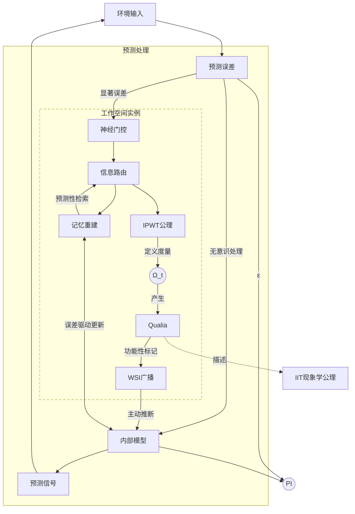

# 整合预测工作空间理论：迈向意识科学的统一框架

## _——基于预测编码、工作空间理论与信息整合理论现象学的融合_

### 摘要

意识的本质是神经科学和哲学领域最深刻的未解之谜之一。现有主流意识理论，如整合信息理论（IIT）、全局工作空间理论（GWT）以及预测编码（PCT）和自由能原理（FEP），各自在解释意识的某些方面取得了进展，但也面临计算可行性、物理基质依赖性及对复杂意识现象解释力不足等局限。本文提出**整合预测工作空间理论（IPWT）**，一个统一的意识框架。IPWT 将 PCT/FEP 作为意识生成与维持的动力学基础，WT 作为信息整合与广播的架构平台，并将 GWT 定义为 WT 的一种特殊配置。核心创新在于对整合信息理论（IIT）核心公理的重构，通过引入基于协同信息（Synergy）的“信息整合的逻辑不可约性”概念，取代其物理因果不可分性，使其能够适用于信息流和计算层面的整合，从而摆脱对特定物理因果拓扑的严格依赖，并克服了原始 IIT 的计算不可行性难题。IPWT 旨在提供一个计算上可行且具有强大临床解释力的意识模型，为意识科学提供统一范式，并为精神疾病干预提供理论指导。

**关键词**：意识理论；预测编码；自由能原理；全局工作空间；整合信息理论；协同信息；计算神经科学；分离性身份障碍

### 1. 引言：意识理论的整合困境与 IPWT 的提出

意识，作为人类最核心的体验，其神经基础和哲学本质一直是科学与哲学探索的硬问题。尽管神经科学在揭示意识相关神经活动方面取得了巨大进步，但关于意识如何从物质中涌现，以及其功能和结构如何被统一解释，仍缺乏一个普遍接受的理论框架。当前，意识科学领域呈现出一种理论分裂的局面，主要存在以下几种具有影响力的理论范式：

#### 1.1. 整合信息理论 (Integrated Information Theory, IIT)

IIT 从现象学出发，通过公理和公设推导出意识的物理基础，其核心思想是意识的本质在于一个系统所能产生的整合信息量（Φ 值）及其内在因果结构。IIT 深刻洞察了意识体验的统一性、独特性和内在因果力。然而，IIT 面临严峻挑战：Φ 值计算的计算不可行性（NP-Hard），以及对意识与特定物理系统内在因果结构的强绑定，尤其是其物理因果不可分性的假设，使其在解释意识的载体独立性方面力不从心。此外，其 Φ 值是否真正捕捉到了主观感受（Qualia）的本质，仍存在争议。

#### 1.2. 全局工作空间理论 (Global Workspace Theory, GWT)

GWT 是一种认知架构理论，将意识比作一个剧场，少数信息被聚光灯照亮并广播到众多无意识的专业化模块，实现信息广泛共享和协调。GWT 成功解释了意识的有限容量、序列性及在信息整合和决策中的作用。然而，GWT 更多关注意识的功能和信息流，未能深入解释主观感受的为何，且全局工作空间的具体神经机制和边界仍有待明确。

#### 1.3. 预测编码 (Predictive Coding Theory, PCT) 与自由能原理 (FEP)

PCT 和 FEP 是一种统一的认知框架，将大脑视为贝叶斯推断机器，核心任务是最小化内部模型与外部世界之间的预测误差。PCT/FEP 提供了一个强大的框架来解释感知、学习、记忆、行动、甚至情绪和精神疾病 (Clark, 2013; Friston, 2010; Rao & Ballard, 1999)。它强调大脑的能动性（active inference）。然而，其如何直接导致意识的涌现，以及意识的现象学特征如何从预测误差最小化中产生，仍需更明确的理论桥梁。

#### 1.4. 现有整合尝试的不足与 IPWT 的提出必要性

近年来，一些研究者尝试整合上述理论，但如整合世界建模理论（IWMT; Safron, 2022）等未能提供无矛盾且计算可行的统一框架。IWMT 表面上结合 IIT，但实际上并未深入整合其核心公理，而是将其降级为辅助度量，并承认 Φ 值计算的不可行性，提议使用"近似度量"替代，这实际上是对 IIT 核心概念的妥协和回避。IWMT 未能解决 IIT 对物理因果拓扑的强依赖问题，也未阐明如何在非生物系统中实现真正的整合。其理论更多地是将不同理论的组件并列，而非将其内在机制进行深度融合。此外，一些学者对意识理论的科学性标准提出了质疑 (Klincewicz et al., 2025)，并引发了关于意识理论范式的激烈辩论 (Tononi et al., 2025)。

这些局限性凸显了构建一个真正统一、计算可行且具有强大解释力的意识理论的必要性。**整合预测工作空间理论（IPWT）** 正是在此背景下被提出，旨在弥补现有理论的不足，并为意识科学提供一个更具前景的框架。IPWT 的核心贡献在于：

1. **深度整合 PCT、FEP 和 WT**：将 PCT/FEP 作为意识内容生成和维持的动力学引擎，WT 作为信息整合和广播的架构平台，并将传统的 GWT 定义为 WT 的一种特殊且高度整合的配置。
2. **重新诠释信息整合现象学**：将 IIT 现象学的五个核心洞见（存在、信息、整合、排他、因果）诠释为信息流在 WT 架构中被处理和协同整合（synergistically integrated）时所展现的属性，从而摆脱对物理因果拓扑的强依赖，使其在信息流和计算层面变得可操作和可验证 (Oizumi et al., 2014; Tononi, 2012; Tononi et al., 2016)。
3. **阐明工作空间的动态信息整合与广播机制**：IPWT 进一步阐述了 WT 中信息如何被整合成一个统一的意识体验的内在计算原理，并明确了其神经机制和边界。
4. **提出特殊意识状态的 IPWT 诠释**：利用 IPWT 框架，为多种复杂意识现象提供新的神经计算解释。
5. **计算可验证性与工程化潜力**：探讨 IPWT 如何通过信息论度量和计算模型实现意识状态的验证。

本文的结构如下：第二章将详细阐述 IPWT 的核心构建，包括其基本假设、PCT/FEP 的动力学作用、WT 的架构功能以及对 IIT 现象学的新诠释。第三章将探讨 IPWT 的计算可验证性与信息整合度量。第四章将阐述 IPWT 的神经生物学验证路径。第五章将以多种特殊意识状态为例，展示 IPWT 在临床神经科学中的应用前景。第六章将讨论 IPWT 的哲学与科学意义，并展望未来的研究方向。第七章将进行讨论与展望，第八章为结论。

### 2. 整合预测工作空间理论 (IPWT) 的核心构建

IPWT 旨在通过深度融合预测编码（PCT）、自由能原理（FEP）和工作空间理论（WT），并对信息整合理论的公理进行重构，从而构建一个统一、计算可行且载体独立的意识模型。本章将详细阐述 IPWT 的基本假设、各组成部分的具体作用及其相互作用机制。

#### 2.1. IPWT 的基本假设与核心原则

IPWT 建立在以下几个核心假设之上，这些假设共同构成了其理论的基石：

1. **意识是信息整合的产物**：IPWT 认为，意识并非某种神秘的非物质实体，而是信息在特定架构中被高效整合和处理时涌现的现象。这种整合不仅仅是信息的简单汇聚，这种整合的本质，我们定义为协同（Synergy）：即信息之间形成一个逻辑上不可约的、整体大于部分之和的全新关系的过程。
2. **意识是预测驱动的**：认知系统通过持续的预测和误差最小化来构建和维持其内部世界模型。意识内容是这一动态过程的体现，它反映了系统对当前和未来环境的最佳解释和适应。
3. **意识是工作空间化的**：存在一个或多个动态的、有限容量的信息处理与整合中心，称之为**工作空间实例（Working Space Instance, WSI）**。这些工作空间使得信息可被广泛访问和利用，从而实现不同认知模块之间的信息共享和协调。

这些原则共同塑造了 IPWT 的功能主义立场：意识的本质在于其所执行的功能和信息处理方式，而非其底层物质构成。

#### 2.2. 预测编码 (Predictive Coding Theory, PCT) 与自由能原理 (FEP) 作为动力学引擎

在 IPWT 中，PCT 和 FEP 构成了意识生成和维持的**核心动力学引擎**。它们解释了信息是如何被系统生成、处理、更新以及为何会持续存在。它们为意识内容的涌现提供了根本的驱动力。

##### 2.2.1. 信息生成与误差最小化

认知系统被建模为一个分层的生成模型，其核心任务是不断生成对感官输入的预测，并最小化这些预测与实际输入之间的误差。

- **分层生成模型**：大脑被视为一个多层级的贝叶斯网络，其中每一层都试图预测其下一层的输入。高层级（例如，抽象概念、意图）向低层级（例如，具体感知、运动指令）传递自上而下的预测信号 (Qian et al., 2025)。数学上，这可以表示为 $P(s_t | m)$，其中 $s_t$ 是在时间 $t$ 的感官状态（即实际感官输入），而 $m$ 是系统的内部模型（即系统对世界的生成模型）。
- **预测误差 (Prediction Error)**：当实际感官输入与系统自上而下的预测不符时，就会产生预测误差。这些误差信号以自下而上的方式传递到更高层级，驱动内部模型的更新。预测误差 $\epsilon_t = s_t - \hat{s}_t$。$\hat{s}_t$ 是内部模型 $m$ 对 $s_t$ 的预测。误差信号的强度和方向指示了内部模型需要调整的程度和方向。尽管形式上是简单的差值，但预测误差的本质是系统内部模型与外部输入之间**信息上的不一致性**，这与信息论中的**惊奇度（Surprise）**和**KL 散度**概念紧密相关。
- **自由能最小化 (Free Energy Minimization)**：FEP 提供了一个统一的数学框架，指出系统通过两种基本方式来持续最小化其自由能（即预测误差的上限）：
  1. **更新内部模型（Perceptual Inference and Learning）**：当预测误差较大时，系统会调整其内部模型，使其能够更准确地预测未来的感官输入。这对应于学习和认知更新。
  2. **改变感官输入（Active Inference and Action）**：系统也可以通过采取行动来改变其感官输入，使其与内部模型的预测相符。这对应于主动推断和行为生成。自由能函数使用_自由能原理的标准形式_ $F(s, m) = D_{KL}[Q(z|s) || P(s, z|m)] - \mathbb{E}_Q[\log P(s|z,m)]$ ，其中 $Q(z|s)$ 是对隐藏状态 $z$ 的近似后验推断，代表系统对给定感官输入 $s$ 时隐藏状态 $z$ 的最佳推断；而 $P(s, z|m)$ 是生成模型，描述了在给定内部模型 $m$ 和隐藏状态 $z$ 的情况下，感官输入 $s$ 的生成过程。最小化 $F$ 相当于最大化模型证据和最小化预测误差 (Friston, 2010)。

##### 2.2.2. 内部模型与环境交互

IPWT 强调，意识内容并非简单地反映外部世界，而是系统内部模型对外部世界的**最佳预测和解释**。这种解释是动态的、能动的，并不断通过与环境的交互进行优化。

- **能动性与自我感**：通过 FEP 驱动的预测-误差循环，系统不断优化其内部模型，使其能够更准确地预测环境，并更有效地采取行动以符合这些预测。这种持续的交互和优化，是意识内容得以持续涌现和更新的基础。主动推断（Active Inference）是 FEP 的一个核心推论，它指出系统不仅被动地接收信息，更主动地通过行动来塑造其感官输入，以符合其内部模型 (Adams et al., 2013; Friston, 2009)。这种能动性是意识体验中自我感和控制感的重要来源，因为个体感受到自己是环境的积极参与者和塑造者。
- **意识内容的涌现**：意识内容并非随机产生，而是 PCT/FEP 驱动的预测-误差循环中，那些被成功最小化误差、并达到一定显著性阈值的信息。这些信息代表了系统对当前环境最自信或最重要的解释。
- **记忆作为内部预测模型的核心组成部分**：系统的内部模型（对世界的认知图谱）本质上就是一种动态的、预测性的记忆。记忆检索是一个主动的预测过程，系统根据当前上下文和目标，预测最相关的记忆内容。

IPWT 强调记忆作为内部预测模型的核心组成部分，并与**分布式记忆计算模型**相兼容。记忆是分布式存储的，而非像文件一样颗粒分明地分开。记忆检索依赖于**特定的网络激活模式** (Rolls, 2024) 和**不同的注意力策略**。一些研究者（如 Budson et al., 2022）甚至提出，意识可能作为情景记忆系统的一部分而演化，用于灵活地重组信息以规划未来，这与 IPWT 中预测性记忆和主动推断的作用相呼应。此外，预期驱动的感觉适应支持分类知觉中增强的敏锐度 (Sainburg et al., 2025)，人类嗅觉系统也存在预测编码机制 (Lyons & Gottfried, 2025)，并且预测编码可能比我们想象的更具认知性，这在前额叶皮层中得到了新的发现 (Gabhart et al., 2025)。

#### 2.3. 工作空间理论 (WT) 作为核心架构平台

WT 假设存在一个或多个**动态的、有限容量的信息处理与整合中心**，称之为**工作空间实例（Working Space Instance, WSI）**。每个 WSI 负责在特定范围内对信息进行整合、处理，并将其广播给与该 WSI 相关的认知模块。WT 在 IPWT 中扮演着**信息整合与广播的架构平台**角色，它解释了意识的统一性、有限容量以及信息共享机制。WT 为 PCT/FEP 驱动的信息流提供了一个舞台，使其能够被广泛共享并形成统一的意识体验。

##### 2.3.1. 核心属性

- **有限容量**：解释意识的焦点性和序列性。
- **信息整合**：WSI 内部信息形成逻辑统一的认知状态。
- **局部广播**：WSI 将信息广播给其**关联的**或**在其作用范围内的**认知模块，而非强制性地广播给所有模块。心盲症可以被理解为功能性连接障碍 (Liu & Bartolomeo, 2025)，体感皮层中的双边整合受行为相关性控制 (Park et al., 2025)，这揭示了目标导向的半球间耦合机制，支持工作空间理论中的信息广播假设。
- **动态性**：WSI 可以根据需要形成、分离、合并或消散。

##### 2.3.2. GWT 作为 WT 的特殊配置

- **重新定义**：传统的全局工作空间（GWT）被定义为 WT 的一种**特殊且高度整合的配置**。当一个 WSI 的广播范围和整合程度达到最大化，能够有效地协调和共享来自绝大多数或所有相关认知模块的信息，并形成一个统一、连贯、稳定的意识体验时，它便成为一个全局工作空间。

##### 2.3.3. WT 与 FEP-PCT 分层整合的兼容性

- **WSI 的角色**：WSI 并非 FEP-PCT 层次结构中的单一层，而是**跨层级的、高阶的信息整合与广播机制**。它接收来自低层级模块的已处理信息和显著预测误差信号，并进行高阶预测误差最小化。默认模式网络的结构功能研究也支持工作空间理论架构 (Paquola et al., 2025)。
- **多个 WSI 的解释**：当存在多个 WSI 时，这可被解释为 FEP-PCT 层次结构中**最高层级整合的碎片化或并行化**。每个 WSI 都是一个相对独立的 FEP-PCT 子系统，独立最小化其内部自由能，导致预测误差的隔离。

#### 2.4. 信息整合理论公理的重构

IPWT 对 IIT 的现象学公理进行了**根本性重构**，使其不再依赖于物理因果拓扑，而是将其诠释为**信息流在 WT 架构中被处理和整合时所展现的属性** (Oizumi et al., 2014; Tononi, 2012; Tononi et al., 2016)。这使得 IIT 的深刻洞察在计算和信息层面变得可操作和可验证，从而克服了原始 IIT 的计算不可行性和物理基质依赖性问题。

##### 2.4.2. 信息整合的逻辑不可约性取代物理因果不可分性

Tononi 原始 IIT 强调的物理因果不可分性是其计算 Φ 值的核心，要求意识系统必须是一个物理上不可约的整体，其因果力不能被分解成更小的、独立的子系统，这导致 IIT 对生物大脑特定物理拓扑的强依赖。

IPWT 提出**信息整合的逻辑不可约性**：意识的整合性并非源于物理连接的不可约性，而是源于信息在 WSI 中被整合后，其**逻辑上无法被分解为更小的、独立的、仍能产生相同因果效应的信息单元。这正是信息论中协同（Synergy）概念的功能性体现：一个整合后的整体所产生的因果效应，是其任何子集都无法独立产生的。** 这种不可约性是信息层面的，而非物理层面的，从而摆脱了对特定物理基质的依赖。它强调的是信息内容和其功能性因果力的不可约性，而非其物理载体的不可约性。

- **应用范围**：这一核心概念应用于**每个独立的 WSI**。意识的本质在于信息在某个 WSI 中形成一个不可约的整体，而不在于这个 WSI 是否全局地连接了所有可能的模块。
- **示例**：当 WSI 整合了红色、圆形和移动的信息，形成一个红色的圆形物体正在移动的意识内容时，这个整合后的信息单元集合在逻辑上是不可分的。如果将其分解为红色、圆形和移动三个独立的信息，它们将无法单独产生一个红色的圆形物体正在移动所能产生的完整因果效应（例如，识别出是球，并预测其轨迹）。这种不可约性是信息在 WSI 中通过复杂交互和编码形成的，而非简单物理连接的属性。
- **与 IIT 的关系**：IPWT 对 IIT 核心洞察的借鉴和功能化，而非严格意义上的整合或兼容。IPWT 旨在构建一个**功能等效**于 IIT 所描述的意识体验的系统，而非严格遵循其物理因果拓扑。

##### 2.4.3. IIT 五公理的 WT 诠释

通过信息整合的逻辑不可约性的视角，IPWT 对 IIT 的五个核心公理进行了如下重构和诠释：

1. **存在 (Existence)**：当一个信息单元（例如，一个由 PCT 生成的预测信号、一个在 WSI 中被广播的概念）在系统中被激活并被处理，尤其是在 WSI 中被整合时，它就存在于该认知状态中。这种存在是信息性的，而非仅仅是物理上的存在。它意味着信息单元在系统中具有可被识别和处理的地位。
2. **信息 (Information)**：每个信息单元都携带独特的、可区分的内容，能够减少系统的不确定性，并对其他信息单元产生影响。这种信息性体现在 PCT 模型的预测误差信号中（误差本身就是一种信息），以及 WSI 中广播内容的特异性（每个广播内容都承载了特定的语义信息）。
3. **整合 (Integration)**：多个信息单元在 WSI 中被汇聚、组合，形成一个统一的、协同的认知状态。这种整合是信息层面的，通过 WSI 的广播机制实现，使得原本分散的信息变得相互关联并形成一个整体。这种整合的程度，即其协同性（Synergy），可以通过部分信息分解（PID）框架进行理论上的量化，它反映了信息在 WSI 中形成一个逻辑上不可约的整体的程度。
4. **排他 (Exclusion)**：由于 WSI 的容量限制和注意力机制，只有最显著、最相关或预测误差最小的信息能够占据工作空间，从而排除其他竞争性信息进入意识。这解释了意识的有限容量和焦点性，以及为何在任何给定时刻，我们只体验到少数清晰的意识内容。这种排他性是 WSI 路由控制器的一种动态选择机制。
5. **因果 (Causation)**：WSI 中整合的信息能够作为因果驱动力，影响其他模块的活动，导致进一步的认知处理、决策或行为输出。WSI 中广播的信息能够改变其他模块的预测和行动，从而产生可观察的因果效应。例如，WSI 中整合的危险信息可以触发逃跑模块的行动，或更新长期记忆中的相关联想。视觉处理中超越绑定的概念 (Scholte & de Haan, 2025) 也支持 IPWT 的信息整合不可约性观点。

通过这种重构，IPWT 成功地将 IIT 的深刻洞察融入到一个计算可行且载体独立的框架中，为意识的本质提供了新的视角。它将意识从一个神秘的物理现象，转化为一个可被理解、可被建模、可被验证的信息处理过程。

#### 2.5. 推论：为何预测误差最小化必然驱动信息整合最大化？对“聪明白痴”问题的形式化论证

IPWT 的核心主张之一是，预测完整性（PI）与信息整合度（$\Omega_t$）之间存在着内在的、必然的关联。一个看似合理的反驳是“聪明白痴”问题：是否存在一个系统，它能以极高的效率预测环境（高 PI），但其内部实现是高度模块化、非整合的（低 $\Omega_t$）？IPWT 认为，在任何现实的物理、计算和演化约束下，这种“聪明白痴”系统都无法长期存在或无法达到高级意识水平。高 PI 与高 $\Omega_t$ 之间的关系并非偶然，而是在物理、计算和演化压力下的**必然趋同**。

为形式化论证这一观点，我们首先定义“聪明白痴”系统：

**形式化定义“聪明白痴”系统 (Clever Idiot, CI)**：
设一个认知系统 $S$ 具有内部模型 $M$ 和一组信息单元 $X = \{X_1, X_2, ..., X_n\}$，用于预测环境输入 $Y$。

- **高预测完整性 (High PI)**：系统 $S$ 能够持续地、高效地最小化其预测误差 $\epsilon = Y - \hat{Y}$（其中 $\hat{Y}$ 是 $M$ 对 $Y$ 的预测），并合理地估计其不确定性 $\tau$。形式上，对于任意时间步 $t$，系统 $S$ 的瞬时预测完整性 $\text{PI}_t = \exp\left(-\alpha \cdot \left( \frac{\|\epsilon_{t}\|_2}{\tau_{t}} + \gamma \cdot \text{Surprise}_{t} \right)\right)$ 保持在高于某个阈值 $PI_{th}$ 的水平。这意味着系统对环境的建模和预测能力极强。
- **低信息整合度 (Low $\Omega_t$)**：系统 $S$ 的内部模型 $M$ 在预测 $Y$ 时，其内部信息单元 $X$ 之间缺乏协同整合。形式上，瞬时信息整合度 $\Omega_t(X \to Y) = \frac{\text{CI}(X_1, ..., X_n; Y)}{I(X_1, ..., X_n; Y)}$ 保持在低于某个阈值 $\Omega_{th}$ 的水平。这意味着 $M$ 主要是通过大量独立的、冗余的或简单并列的信息单元来完成预测，而非通过发现底层抽象结构和因果关系，形成一个逻辑上不可约的整体。它更像一个巨大的“查找表”或“规则集合”，而非一个能够进行深层理解和泛化的生成模型。

“聪明白痴”问题即是：是否存在一个系统，在现实约束下，能够长期维持高 PI，同时其内部模型始终保持低 $\Omega_t$？IPWT 认为答案是否定的，其论证如下：

##### 论证 1：效率约束 (The Efficiency Constraint)

任何物理系统都受限于有限的能量、计算资源和存储容量。一个低 $\Omega_t$ 的“聪明白痴”系统，其内部模型本质上是一个巨大的、未压缩的查找表或规则集。维持和查询这样一个庞大的、冗余的数据库，需要天文数字般的能量和计算资源。而一个高 $\Omega_t$ 的整合系统，其内部模型是**高度压缩**的，通过发现数据背后的共同规律和抽象结构，用更少的资源实现同等甚至更强的预测能力。自由能原理（FEP）本身就包含了最小化模型复杂度的要求（作为对模型证据的近似）。

形式上，设 $C(M)$ 为维持和运行内部模型 $M$ 所需的资源成本。对于一个 CI 系统，其低 $\Omega_t$ 的内部模型 $M_{CI}$ 意味着信息的高度冗余和低压缩率，导致其资源成本 $C(M_{CI})$ 远高于一个能够实现相同 PI 的高 $\Omega_t$ 整合模型 $M_{Integrated}$。即：$\forall M_{CI}, M_{Integrated}$ s.t. $\text{PI}(M_{CI}) \approx \text{PI}(M_{Integrated})$, we have $C(M_{CI}) \gg C(M_{Integrated})$。因此，在演化或优化过程中，系统会倾向于选择在达到相同预测性能（PI）下，资源成本最低的解决方案——即高 $\Omega_t$ 的整合方案。

##### 论证 2：泛化与适应性约束 (The Generalization Constraint)

真实世界是动态、开放且充满新奇事件的，系统必须能够泛化到未曾遇到的情境。一个低 $\Omega_t$ 的 CI 系统类似于**过拟合（Overfitting）**的终极体现。它能完美预测它被训练过的所有情况，但当遇到一个全新的、前所未见的事件时，它会彻底崩溃。而高 $\Omega_t$ 的整合系统，因为它理解的是生成世界的**底层规则和因果结构**，所以它具备强大的**泛化能力**，能对新奇事物做出合理的预测。

形式上，一个低 $\Omega_t$ 的 CI 系统 $M_{CI}$ 对训练数据（已观测到的环境状态 $Y_{old}$）的预测能力极强，但对新奇的、未曾直接学习过的环境状态 $Y_{novel}$ 的预测能力极差。即：$\text{PI}(M_{CI}, Y_{old}) \approx \text{High}$, but $\text{PI}(M_{CI}, Y_{novel}) \approx \text{Low}$。相比之下，一个高 $\Omega_t$ 的整合系统 $M_{Integrated}$ 能够同时在已知和未知情境下保持高 PI。即：$\text{PI}(M_{Integrated}, Y_{old}) \approx \text{High}$, and $\text{PI}(M_{Integrated}, Y_{novel}) \approx \text{High}$。在一个动态、开放、不断变化的环境中，只有具备泛化能力的系统才能长期生存。因此，**长期维持高 PI 的唯一途径，就是发展出高 $\Omega_t$ 的整合模型。**

##### 论证 3：能动性与自我模型约束 (The Agency Constraint)

高级意识系统不仅是被动的预测者，更是**主动的行动者（Active Inference）**。它需要规划未来，并采取行动来让世界符合它的预测。为了规划行动，系统必须建立一个关于**自我**的模型——我是谁，我能做什么，我的目标是什么。将自我建模成一个统一、整合的行动者（高 $\Omega_t$），其计算和决策效率，远高于将自我建模成一百万个独立规则的集合。

形式上，一个代理（Agent）通过选择行动 $A$ 来改变环境 $E$ 并最小化未来的预测误差。这需要一个内部模型 $M_{self}$ 来预测自身行动的后果和自身与环境的交互。一个低 $\Omega_t$ 的自我模型 $M_{self, CI}$ 是碎片化且不连贯的，导致其行动规划效率低下，甚至产生矛盾的行动指令，从而频繁导致行动后的高预测误差。即：$\text{PI}(M_{self, CI}, A \to E') \approx \text{Low}$。而一个高 $\Omega_t$ 的整合自我模型 $M_{self, Integrated}$ 能够高效地规划连贯的、目标导向的行动，从而有效最小化预测误差。即：$\text{PI}(M_{self, Integrated}, A \to E') \approx \text{High}$。因此，**成为一个高效行动者的需求，反过来强制系统必须发展出一个整合的、高 $\Omega_t$ 的自我表征。**

综上所述，“聪明白痴”系统在理论上或许可以被构想，但在现实世界的严苛约束（资源有限、环境动态、需要主动行动）下，它是不稳定且不可持续的。一个能够长期高效预测并最小化误差的系统，其内部表征**必须**是高度一致、非冗余且协同的。因此，高 PI 不仅与高 $\Omega_t$ 相关，而且是驱动系统向高 $\Omega_t$ 演化的根本动力。这使得可计算的预测完整性（PI）作为理论信息整合度（$\Omega_t$）的功能性代理，具有了坚实的理论基础。

### 3. IPWT 的计算可验证性与信息整合度量

IPWT 的核心优势在于其固有的计算可验证性。本章将详细阐述 IPWT 如何通过信息论工具来度量意识的整合性，并探讨其在计算模型中的验证路径。

#### 3.1. 瞬时信息整合度 ($\Omega_t$)：基于 PID 的理论定义

在本理论中，我们将 IIT 所追求的“整合”概念，通过部分信息分解（PID）框架，重新形式化为一种可被理论定义的“协同性（Synergy）”。瞬时信息整合度 ($\Omega_t$) 是衡量工作空间实例（WSI）中信息协同性的理论黄金标准。为了使其定义在数学上更加严谨，我们基于 **部分信息分解（Partial Information Decomposition, PID）** 框架对其进行定义。

设 WSI 中的信息单元集合为 $X = \{X_1, X_2, ..., X_n\}$，它们共同用于预测一个目标变量 $Y$（例如，下一时刻的感官输入或系统的行动策略）。根据 PID 框架，这些信息源 $X$ 对目标 $Y$ 的总互信息 $I(X; Y)$ 可以被分解为协同信息（Synergy）、冗余信息（Redundancy）和每个源的独有信息（Unique Information）。

我们因此将 **瞬时信息整合度 `Ω_t` 定义为协同信息在总的预测性信息中的占比**：

$$
\Omega_t(X \to Y) = \frac{\text{CI}(X_1, ..., X_n; Y)}{I(X_1, ..., X_n; Y)}
$$

- **CI(X; Y)**：协同信息（Synergistic Information），衡量信息集合 $X$ 作为一个整体，所提供的、无法被其任何子集独立提供的关于 $Y$ 的信息量。这完美地捕捉了逻辑不可约性的精髓。
- **I(X; Y)**：$X$ 和 $Y$ 之间的总互信息，代表了 WSI 中的信息对预测目标的全部贡献，用于归一化。

此定义在数学上严谨，概念上清晰。然而，我们必须强调，PID 框架中协同信息 `CI` 的计算本身是一个极其困难的前沿问题，对于高维系统，在实践中是不可行的。因此，`Ω_t` 是一个**纯粹的理论概念框架**，其作用是为信息整合提供一个理论定义，并为我们引入其可计算代理——预测完整性（PI）——提供坚实的理由。

#### 3.2. 预测完整性 (PI) 与预测完整性积分 (∫PI)：可计算代理与意识验证标准

鉴于 `Ω_t` 的计算不可行性，IPWT 引入预测完整性 (PI) 作为其可计算的、功能性的代理。PI 衡量系统内部模型与外部环境的自洽程度，及其行为能否有效最小化预测误差。

$$
\text{PI} = \exp\left(-\alpha \cdot \left( \frac{1}{N} \sum_{k=1}^{N} \frac{\|\epsilon_{t,k}\|}{\tau_{t,k}} + \gamma \cdot \text{Surprise}_{t,k} \right)\right)
$$

此公式**直接继承自自由能原理（FEP）的基本结构**。括号内的项 `(...)` 代表了系统的**认知成本**或**预测能量**，而指数形式 `exp(-...)` 则源于统计力学中的玻尔兹曼分布，将此成本转化为系统处于高预测完整性状态的**概率性度量**。

- **核心成本项**：
  1. **不准确性成本 (`ε/τ`)**：`ε_t,k` 是预测误差。`τ_t,k` 是其逆精度（即方差），代表了系统对该通道预测的**预期不确定性**。在 FEP 框架中，`τ` 是模型内生的、由注意力等机制动态调节的参数。
  2. **不一致性/复杂度成本 (`Surprise`)**：`Surprise_t,k` 捕捉了内部模型的逻辑不一致性。在 FEP 中，这对应于近似后验分布与先验分布之间的 KL 散度，是一个**高度非线性**的度量。
- **公式的非线性本质**：虽然表面上是加法形式，但其每一个组成部分（尤其是 `Surprise` 和动态精度 `τ`）都蕴含着深刻的非线性，从而确保了整个公式能够捕捉复杂系统的动态特性。
- **参数的理论意义 (`α`, `γ`)**：这些参数并非临时的调节旋钮，而是描述系统**认知风格**的关键变量。`α` 代表系统对错误的敏感度，而 `γ` 则代表系统在外部准确性和内部一致性之间的世界观权重。

**指标的操作化挑战**：
将 `Surprise` 和 `τ` 等理论概念转化为可计算的数值，是本理论走向实践的**核心挑战**。这些指标的具体计算方法，将依赖于对 `ds005795` 等多模态数据集的探索性数据分析（EDA），并在 **PyPoPI** 计算库的实现中进行算法化。其核心目标是寻找能够最有效地区分不同意识状态的神经特征，并将其映射到 FEP 框架下的惊奇度和精度概念上。

**预测完整性积分 (∫PI)**：
∫PI 代表在时间窗口 T 内，系统预测完整性的持续强度和稳定性，是 PI 在时间上的积分，其公式与惩罚系数 `δ` 的意义与 PI 类似。

$$
\int\text{PI} = \frac{1}{T} \int_{t_0}^{t_0+T} \text{PI}_t dt \times \exp\left(-\delta \cdot \text{Var}(\text{PI}_t)\right)
$$

### 4. 神经生物学验证路径与可证伪性

IPWT 的理论预测可以通过现有的神经科学技术进行验证，从而将其从纯粹的计算模型提升到生物学层面。

#### 4.1. 神经影像学研究 (fMRI, PET)

- **WSI 激活模式**：利用 fMRI 观测在意识任务中，与 WT 相关的神经网络（如前额叶-顶叶网络、丘脑-皮层回路）的激活模式。IPWT 预测，在意识状态下，这些区域的活动将表现出更高的信息整合度（$\Omega_t$ 值）。
  - **WSI 作为动态功能网络状态**：WSI 不是一个固定的脑区，而是由不同脑区（包括前额叶、顶叶、丘脑、甚至部分皮层下结构）在特定时刻形成的**动态功能连接模式或网络状态**。不同的 WSI 可能涉及这些脑区**不同的子集或不同的连接权重模式**。
  - **神经活动模式**：WSI 的激活可能与特定神经活动模式相关，例如，在特定脑区或网络中出现高频 Gamma 同步。同时伴随低频 Theta/Alpha 的门控作用。
  - **Beta (13-30 Hz)**: 可能与维持当前 WSI 的稳定状态和抑制其他 WSI 的干扰有关。
  - **Alpha (8-13 Hz)**: 可能与信息门控和抑制不相关信息进入 WSI 有关。
  - **Theta (4-8 Hz)**: 可能与 WSI 的形成、更新或切换过程相关，作为一种高阶的协调信号。
  - **Delta (0.5-4 Hz)**: 可能与深度睡眠或无意识状态下 WSI 的解体或低整合状态相关。
  - **相位-幅度耦合（Phase-Amplitude Coupling, PAC）**：研究不同频段振荡之间的 PAC，这可能反映了 WSI 中信息整合的层级结构。PAC 可能反映了 WSI 内部不同层级信息处理的整合，例如，低频振荡（Theta/Alpha）的相位调制高频振荡（Gamma）的幅度，可能反映了注意力门控如何影响信息在 WSI 中的整合强度。
- **信息流追踪**：利用功能连接分析和有效连接分析，追踪信息在不同脑区之间以及向 WSI 广播的动态过程。可以计算不同脑区之间信息流的互信息，并评估其在 WSI 中的整合程度。
  - **信息传输效率**：可以通过**有效连接分析（Effective Connectivity Analysis）**来估计不同脑区或网络（假定与不同 WSI 相关）之间的信息流强度和方向。信息传输效率限制可能表现为特定连接的有效连接强度降低。
  - **神经门控机制**：神经门控机制是抽象的计算概念，其神经实现涉及**抑制性神经回路的门控作用**。例如，通过研究与抑制性中间神经元相关的神经活动或神经递质（如 GABA）的功能，来推断信息流的门控机制。在神经影像学上，神经门控机制可能表现为特定连接的**动态抑制或解耦**，这可以通过动态功能连接分析来捕捉。例如，在 DID 患者中，fMRI 显示前扣带回激活分裂，这可能支持 WSI 隔离假说（Reinders et al., 2019, pp. 536–544），即不同人格态切换时，与不同 WSI 相关的网络之间的功能连接会发生显著变化，这可能反映了神经门控机制的动态调整。
- **意识水平评估**：在不同意识状态（如清醒、睡眠、麻醉、昏迷）下，测量 WSI 相关网络的 ∫Ω 和 PI 值。IPWT 预测，这些值将与意识水平呈正相关。

#### 4.2. 电生理学研究 (EEG, MEG, ECoG)

- **神经振荡与工作空间切换**：
  - **高频振荡（Gamma 频段）**：IPWT 预测，在 WSI 中整合的信息将伴随高频 Gamma 振荡的同步。高 $\Omega_t$ 状态可能与 WSI 内部广泛区域的 Gamma 同步相关。
  - **Beta (13-30 Hz)**: 可能与维持当前 WSI 的稳定状态和抑制其他 WSI 的干扰有关。
  - **Alpha (8-13 Hz)**: 可能与信息门控和抑制不相关信息进入 WSI 有关。
  - **Theta (4-8 Hz)**: 可能与 WSI 的形成、更新或切换过程相关，作为一种高阶的协调信号。
  - **Delta (0.5-4 Hz)**: 可能与深度睡眠或无意识状态下 WSI 的解体或低整合状态相关。
  - **相位-幅度耦合（Phase-Amplitude Coupling, PAC）**：研究不同频段振荡之间的 PAC，这可能反映了 WSI 中信息整合的层级结构。PAC 可能反映了 WSI 内部不同层级信息处理的整合，例如，低频振荡（Theta/Alpha）的相位调制高频振荡（Gamma）的幅度，可能反映了注意力门控如何影响信息在 WSI 中的整合强度。这与 Theta-Gamma 耦合在工作记忆和信息路由中的作用相符。
- **事件相关电位 (ERP)**：研究与意识相关的 ERP 成分，这些成分可能反映了信息进入 WSI 并被整合的过程。IPWT 预测，这些 ERP 成分的幅度和潜伏期将与 WSI 中信息整合的效率和强度相关。
- **扰动复杂度指数 (PCI) 作为 PI 的物理采样基准**：PCI 是一种基于经颅磁刺激（TMS）和 EEG 记录的意识度量。IPWT 认为，PCI 与 WSI 中信息整合的复杂性和逻辑不可约性（即理论上的$\Omega_t$值）高度相关。这种关系并非简单的类比，而是一种**采样关系**：PCI 通过**主动的物理扰动**来采样大脑物理基质的信息整合潜力，而我们提出的 PyPoPI 模型则通过**被动的神经数据观测**来推断信息处理过程的整合效率（PI）。PCI 为纯计算的 PI 值提供了关键的物理世界锚点。Stikvoort 等人（2025）的研究表明，意识水平较低的状态在有效连接不对称性、模拟动力学不可逆性和复杂度方面均低于对照组，这进一步支持了 PCI 作为区分不同意识水平的有效指标，也为 IPWT 的核心假设——意识是高效、复杂的整合过程——提供了强有力的实验证据。因此，利用现有的 PCI 临床数据来校准 PyPoPI 模型，是连接理论计算与物理测量的关键步骤。

#### 4.3. 行为学与心理物理学实验

- **知觉阈限任务**：设计实验，在知觉阈限附近呈现刺激，观察受试者对刺激的意识报告与 WSI 中 $\Omega_t$ 和 PI 值的关系。IPWT 预测，只有当刺激信息在 WSI 中达到足够的 $\Omega_t$ 值时，受试者才能有意识地报告。
- **注意力操纵**：通过注意力线索或任务，操纵受试者的注意力焦点，观察其对 WSI 中信息整合和 $\Omega_t$ 值的影响。
- **多任务处理**：研究受试者在多任务处理时的表现，以及其 WSI 中 $\Omega_t$ 和 PI 值的动态变化。IPWT 预测，在多任务切换时，WSI 的 $\Omega_t$ 值可能出现短暂下降或在不同任务相关信息之间快速切换。
- **具体实验范式**：
  - **经颅磁刺激（TMS）抑制实验**：通过 TMS 暂时抑制健康被试的**背外侧前额叶皮层（DLPFC）**，该区域被认为是 WSI 路由控制和高阶认知功能的关键区域。在抑制前后，测量被试的 PI 值、主观报告（例如，通过量表评估自我感或现实感）以及在认知任务中的表现。IPWT 预测，DLPFC 抑制将导致 PI 值下降，并可能诱发类似人格解体或意识模糊的主观体验，同时影响任务表现。
  - **人工盲视诱发**：设计实验范式，通过**视觉掩蔽（visual masking）**或**双眼竞争（binocular rivalry）**等技术，在健康被试中诱发人工盲视状态。在此状态下，测量被试的 PI 值和神经活动（如 WSI 激活模式、Gamma 同步），并与主观报告进行关联。IPWT 预测，在人工盲视状态下，尽管存在局部视觉处理，但相关信息在 DWSI 中的 PI 值将低于意识阈值。

### 5. 特殊意识状态的 IPWT 诠释

IPWT 框架，特别是其工作空间理论（WT）、预测编码（PCT）和自由能原理（FEP）的结合，以及对信息传输效率和神经门控机制的强调，为理解多种多样的意识异常状态提供了统一的视角。

#### 5.1. 盲视（Blindsight）

##### 5.1.1. 盲视现象回顾

盲视是指大脑初级视觉皮层（V1）受损的患者，在受损视野区域内报告没有主观视觉意识（盲），但却能对该区域内的视觉刺激做出高于随机水平的反应（视），例如指出光点位置、辨别运动方向或形状。这表明视觉信息在没有意识参与的情况下，仍然能够被大脑处理并指导行为。

##### 5.1.2. IPWT（结合 WT）的重新诠释

在 IPWT 框架下，盲视可以被理解为视觉信息在不同工作空间实例（WSI）或不同处理层级上的差异化整合与广播。

- **盲的方面：缺乏主观意识体验**
  - **V1 损伤对主导 WSI 的影响**：初级视觉皮层（V1）是视觉信息进入大脑皮层并进行初步整合的关键枢纽。V1 的损伤，严重破坏了**高信息传输效率、高保真**的视觉信息流，使其无法有效地传递到负责生成主观视觉意识的**主导工作空间实例（Dominant Working Space Instance, DWSI）**。
  - **预测完整性（PI）不足**：由于关键输入路径受损，DWSI 无法从受损视野区域获得足够完整、一致的视觉信息来构建一个低预测误差的内部模型。因此，来自该区域的视觉信息在 DWSI 内部的**预测完整性（PI）极低**，未能达到 DWSI 产生主观意识体验所需的**整合阈值**。
  - **信息广播失败**：即使有少量信息通过其他路径进入皮层，它们也未能被 DWSI 有效地整合并广播到其内部的各个认知模块，从而无法形成统一的、可报告的视觉意识内容。DWSI 的注意力机制可能也无法将资源有效分配给这些不完整或不显著的信号。
- **视的方面：无意识的行为能力**
  - **替代路径与局部处理**：尽管 V1 受损，但视觉信息仍然可以通过**皮层下通路**（如视丘上丘、丘脑枕核）或**皮层外通路**（绕过 V1 直接到达其他视觉区域，如 MT 区）到达大脑的其他区域。
  - **局部预测编码（PCT）与自由能原理（FEP）**：这些替代路径所连接的**专业化模块**（例如，负责运动检测、空间定位的模块）仍然在独立地进行其**局部预测编码循环**。它们接收到不完整但足以驱动特定任务的视觉输入，并持续最小化其自身的**局部预测误差**。
    - 例如，当一个物体在盲视野中移动时，MT 区（运动感知区域）仍然可以接收到运动信息，并生成对该运动的预测，最小化其内部的运动预测误差。
  - **主动推断（Active Inference）与行为**：这些局部模块的预测误差最小化过程，可以直接驱动**主动推断和行为**而无需信息被整合到 DWSI 中产生主观意识。患者的指向、辨别行为，正是这些局部模块为了最小化其自身的预测误差而采取的行动。
    - 例如，当被要求指向一个光点时，负责空间定位的局部模块会生成一个指向该光点的运动预测，并驱动相应的运动行为，以减少其内部模型与实际光点位置之间的误差。
  - **未达到 WSI 整合阈值**：这些局部处理虽然有效，但其输出信息**未能被整合到 DWSI 中**，或者说，它们在 DWSI 内部的 PI 始终低于意识阈值。因此，患者无法主观报告看到了什么，但其身体（由局部模块驱动）却能做出正确的反应。
  - **盲视中的无意识处理与 WSI 的关系**：盲视中的无意识处理是由**未达到 WSI 整合阈值的局部处理**驱动的。这些局部模块（如 MT 区）的活动，虽然进行信息处理和局部预测编码，但其整合度不足以构成一个独立的、高整合度的 WSI，也未能被 DWSI 整合。因此，它们是**未被 DWSI 整合的局部处理**，而非独立的 WSI。这与 2.3 节 WSI 的定义保持一致，即 WSI 是一个信息处理与整合中心，需要达到一定的整合阈值。

##### 5.1.3. IPWT 解释盲视的关键机制

1. **多 WSI 或 WSI 内部的层级整合**：盲视揭示了意识并非一个简单的开/关状态，而是信息在不同 WSI 或 WSI 内部不同层级上整合程度的差异。主观意识需要信息在 DWSI 中达到高 PI 和 ∫PI，而无意识行为则可能由局部模块的低阶 PI 驱动。
2. **信息传输效率与神经门控机制**：V1 的损伤可以被视为对 DWSI 关键视觉输入通道的**物理信息传输效率限制**。这导致即使有信息通过其他低信息传输效率或旁路通道进入，也无法有效突破 DWSI 的**神经门控机制**（注意力、显著性筛选），从而无法被整合到意识流中。
3. **预测误差的局部化与全局化**：盲视表明，预测误差的最小化可以在局部层面发生，并驱动行为，而无需这些局部误差被整合到 DWSI 中，形成一个统一的、可报告的全局预测误差信号。

##### 5.1.4. 结论

通过 IPWT（结合 WT）的视角，盲视不再是一个简单的看到却不自知的悖论，而是信息在认知系统中不同层级、不同工作空间实例之间，以不同整合程度和信息传输效率进行处理的复杂体现。它强调了主观意识的涌现，需要信息在特定的、高整合度的 WSI 中达到足够的预测完整性，而行为则可以在更局部、更低阶的预测误差最小化过程中产生，即使这些过程未能进入主观意识的聚光灯下。这进一步验证了 WT 框架的灵活性和解释力。

#### 5.2. 迷幻状态 (Psychedelic States)

迷幻药物（如 LSD, Psilocybin）诱导的意识状态以感知扭曲、思维模式改变、自我感模糊或增强、以及强烈的联觉体验为特征。

- **IPWT 诠释**：迷幻状态可以被理解为**预测误差信号的异常增强和信息流的去门控（神经门控机制改变）**，导致工作空间实例（WSI）的边界模糊和信息整合模式的剧烈变化。

  - **预测误差增强**：迷幻药物影响神经递质系统（如血清素），这可能导致系统对感官输入产生**过度的预测误差信号**。这些异常增强的误差信号涌入 WSI，压倒了正常的预测过程，导致感知扭曲和幻觉 (Corlett et al., 2019)。
  - **信息流去门控 (神经门控机制改变)**：迷幻药物可能改变 WSI 路由控制器（分布式注意力网络）的门控机制（神经门控机制）。原本被抑制或隔离的信息流（例如，来自低层级感官处理模块的原始误差信号，或来自不同认知模块的非典型联想）被允许进入 WSI 并被整合。这解释了联觉（不同感官模态信息的异常整合）和思维跳跃。
  - **WSI 边界模糊与临时 WSI 形成**：WSI 之间的边界可能变得模糊，信息可以在原本隔离的 WSI 之间自由流动。甚至可能形成**临时的、高度整合但非典型的 WSI**，负责产生强烈的、具有深刻意义的主观体验。
  - **自我感改变**：负责自我模型的 WSI 可能与感官输入或其他认知模块的连接模式发生改变（信息传输效率/神经门控机制变化），导致自我感与身体或环境的脱离或融合。

- **IPWT 的独特之处**：IPWT 将迷幻体验解释为**可计算的信息流和预测处理异常**，而非仅仅是神经化学失衡。它提供了机制性的解释，说明为何预测误差的改变和信息门控的失效会导致如此多样的感知和认知异常。

#### 5.3. 精神分裂症 (Schizophrenia)

精神分裂症是一种严重的精神障碍，其特征包括幻觉、妄想、思维混乱、情感障碍和社交功能障碍。

- **IPWT 诠释**：精神分裂症可以被理解为**预测编码过程的根本性异常**，导致**异常预测的产生**和**工作空间实例（WSI）间信息整合与门控（神经门控机制）的失效**。

  - **预测异常**：FEP/PCT 框架认为，幻觉是系统内部模型产生的高置信度预测，但这些预测与外部感官输入不符，且未能被正确识别为内部生成 (Corlett et al., 2019)。妄想则是系统为了解释这些异常预测而构建的**高度自洽但与现实脱节的内部模型**，这些模型在特定 WSI 内部具有低预测误差，因此难以被修正。
  - **信息整合与门控失效 (神经门控机制问题)**：动态认知控制系统（分布式注意力网络）的功能障碍可能导致：
    - **异常预测的涌入**：来自低层级模块的异常预测或内部噪声未能被正确门控，直接涌入主导 WSI，被误认为是外部现实。
    - **信息碎片化**：不同认知模块的信息未能被有效整合到一个统一的 WSI 中，导致思维混乱和逻辑断裂。
    - **自我归因错误**：系统无法正确区分内部生成的预测（如自己的想法）和外部输入的感官信息（如他人的声音），导致将内部活动误归因于外部来源（听觉幻觉）。这是一种神经门控机制的失效，未能正确标记信息来源。
  - **WSI 的异常形成或解体**：在某些情况下，可能形成**异常的、与现实脱节的 WSI**，负责产生妄想性思维。或者，主导 WSI 可能变得不稳定，导致意识流的碎片化。

- **IPWT 的独特之处**：IPWT 将精神分裂症的核心症状统一解释为**预测处理和信息整合的计算性异常**。它提供了一个框架来理解幻觉和妄想的机制，以及为何思维和自我感会发生如此严重的障碍。计算精神病学领域的研究也支持利用计算模型理解精神疾病。

#### 5.4. 清醒梦 (Lucid Dreaming)

清醒梦是指在做梦时意识到自己正在做梦，有时甚至能够控制梦境内容。

- **IPWT 诠释**：清醒梦涉及**多个工作空间实例（WSI）的并行运行和高阶 WSI 对低阶 WSI 的监控与控制**。

  - **梦境 WSI**：梦境本身是由一个或多个 WSI 在睡眠状态下生成的，它们通过 FEP/PCT 驱动的内部模型（记忆、联想）产生感官体验和叙事，并最小化内部预测误差。这个 WSI 负责产生梦境的沉浸感。
  - **元认知 WSI**：在清醒梦中，一个**更高阶的、负责自我意识和现实评估的 WSI** 被激活。这个 WSI 能够监控梦境 WSI 的活动，识别其与现实模型的不一致性（高阶预测误差），并得出我正在做梦的结论。
  - **WSI 间的通信与控制**：清醒梦的关键在于这两个 WSI 之间建立了**有限的、有方向的信息传输效率**。元认知 WSI 能够接收来自梦境 WSI 的信息流（梦境内容），并对其进行评估。在某些情况下，元认知 WSI 甚至能够通过某种形式的下行控制信号（改变神经门控机制或影响梦境 WSI 的预测模型参数），来影响梦境 WSI 的生成过程，从而实现对梦境的控制。
  - **预测完整性（PI）的差异**：梦境 WSI 在其内部可能维持较高的 PI（使其内容连贯），但其与外部现实的预测误差巨大。元认知 WSI 则能够识别这种高阶预测误差，并维持对现实模型的 PI。

- **IPWT 的独特之处**：IPWT 将清醒梦解释为**认知架构的动态配置**，特别是 WSI 的分层和交互。它提供了一个框架来理解意识的层次性，以及元认知如何作为一种高阶的预测和控制过程而存在。

#### 5.5. 分离性身份障碍 (DID) 的 IPWT 诠释：分裂工作空间与神经成像证据

IPWT 提出，**分离性身份障碍（DID）**并非简单的自我分裂，而是 IPWT 架构中**并行工作空间实例（WSI）的动态隔离与切换现象**。这一模型将 DID 的复杂症状映射到信息处理机制上，并有望与神经成像证据相契合。

DID 的核心机制在于存在**多个并行运行的 WSI**，它们之间存在**动态的信息传输效率限制**和**神经门控机制**。这种信息传输效率并非物理限制，而是功能性的、动态的限制，通过抑制神经活动、改变突触效能等方式动态限制 WSI 间的信息流。而神经门控机制则是一种高阶的、学习到的门控机制或路由策略，决定 WSI 间的信息广播、共享资源权限、记忆检索权限和预测模型激活。这是一种为了局部最小化自由能而采取的适应性策略。

**动态认知控制系统**在其中扮演关键角色，它被重新定义为**分布式注意力网络**或**动态路由机制**，是一组或一个类的功能集合，而非一个单点。认知控制是分布式和涌现性的，并与杏仁核、脑干、丘脑、基底神经节等潜意识的、进化上更古老的底层脑区紧密相关。这个系统的学习机制可以基于**强化学习**或**预测学习**的原理，通过试错和预测误差最小化，学习在特定情境下（例如，创伤触发器出现时）切换 WSI 的最优策略，以最小化整体系统的自由能或预测误差。这涉及到突触可塑性（例如，长时程增强/抑制）和神经回路的重塑。例如，杏仁核在快速评估威胁、处理情绪显著性方面扮演核心角色。在 DID 中，创伤触发器（高惊奇信号）会迅速激活杏仁核，而杏仁核作为动态认知控制系统的一部分，可以在意识层面形成之前，就将信息流路由到特定的、能够应对该威胁的 WSI（人格）。这解释了人格切换的非自愿性、快速性和适应性（在创伤情境下）。脑干控制着基本的生理功能和唤醒水平，可以根据生存需求强制切换 WSI。丘脑作为感官信息的中继站，可以在潜意识层面决定哪些信息被允许进入哪个 WSI，从而实现记忆隔离和人格间的信息防火墙。基底神经节则可能影响动态认知控制系统在不同 WSI 之间切换的偏好或惯性，使得某些人格切换模式变得自动化。动态认知控制系统可以被视为一个更高层级的 FEP 驱动的预测模型，其目标是最小化整个系统的自由能，即使这意味着需要通过切换不同的 WSI 来实现。创伤触发通常是由于对相似场景的**过度预测**或**泛化**，导致系统进入一种高警觉、高预测性反应状态，而非高新奇性的惊奇，这可能伴随**注意力偏向**。潜意识概念在 IPWT 中被重新定义为**低层级的 PCT 处理**或**未被 WSI 整合的信息**。

**神经成像证据**为这一模型提供了支持。例如，**fMRI 研究**显示，DID 患者在不同人格态切换时，与不同 WSI 相关的网络之间的功能连接会发生显著变化，这可能反映了神经门控机制的动态调整。Reinders et al. (2019) 的研究发现，DID 患者在回忆创伤记忆时，其前扣带回的激活模式会发生分裂，这与 WSI 隔离假说相符。此外，**EEG 研究**可以关注不同人格态下神经振荡模式的差异，特别是 theta 波的查询同步和 gamma 波的结果整合在不同 WSI 间的差异，这可能反映了信息处理和整合方式的改变。

#### 5.6. 人格解体/现实解体障碍 (Depersonalization/Derealization Disorder)

这是一种以持续或反复体验到与自身（人格解体）或周围环境（现实解体）分离感为特征的障碍。患者感觉自己像一个旁观者，或者世界看起来不真实、模糊、遥远。

- **IPWT 诠释**：这种障碍可以被理解为**负责自我模型和现实模型的特定工作空间实例（WSI）与感官输入或情感处理模块之间的信息传输效率或连接性（神经门控机制）的显著降低**。
  - **自我模型 WSI 的隔离**：存在一个负责构建和维持自我模型的 WSI。在人格解体中，这个 WSI 与来自身体感觉、情感处理模块或情景记忆的实时信息流之间的信息传输效率显著降低。自我模型 WSI 无法接收到足够丰富、实时的信息来更新和锚定自我感，导致感觉与自身脱离。
  - **现实模型 WSI 的隔离**：存在一个负责构建和维持对外部现实模型的 WSI。在现实解体中，这个 WSI 与来自感官输入模块的信息流之间的信息传输效率降低，或者其与情感评估模块的连接减弱。外部世界的信息未能被充分整合或赋予情感显著性，导致感觉世界不真实、遥远。
  - **预测误差的抑制或改变**：系统可能通过某种机制（可能是为了应对压倒性的情感或创伤）**抑制或改变**与这些 WSI 相关的预测误差信号。例如，对身体感觉的预测误差被抑制，导致感觉不到身体的真实存在。
  - **WSI 间的神经门控机制改变**：负责自我或现实模型的 WSI 与其他 WSI（如情感 WSI, 行为规划 WSI）之间的神经门控机制可能发生改变，限制了信息共享，导致感觉和行动的分离。

### 6. 临床神经计算诠释：IPWT 在特殊意识状态中的应用

本章将 IPWT 框架应用于多种特殊意识状态，展示其在临床神经科学中的强大解释力。

#### 6.1. 对 Qualia 硬问题的重新定义：从现象学到功能性标记（Functional Label）问题

Qualia（感受质）指的是主观的、内在的感受体验，例如红色是什么感觉，疼痛是什么感觉。它被视为意识的硬问题，即即使我们完全理解了大脑的物理机制，也无法解释为何会有这些主观感受。IPWT 并不直接解决 Qualia 的本体论问题，而是对其进行了**根本性的重新定义和操作化**，将其视为一种 **功能性标记（Functional Label）问题**。这种视角强调 Qualia 的功能性作用，而非其不可还原的主观性。

- **Qualia 作为系统内部的高阶表征**：IPWT 认为，Qualia 并非无用的副现象，而是系统在 WSI 中整合信息时，其内部模型对自身状态和环境交互的一种高阶表征。这种表征的感受性是系统为了优化其预测和行动而产生的一种功能性标记。
- **功能性解释**：Qualia 具有重要的功能性作用。例如，疼痛的 Qualia 是系统对身体损伤的预测误差信号在 WSI 中被高度整合和广播时，所产生的一种**强烈的、不可忽视的内部反馈**。这种反馈旨在强制系统采取行动以最小化这种误差，从而保护自身。红色的 Qualia 则是系统对特定波长光线的一种高效、整合的内部表征，能够迅速触发相关的联想和行为（如停止或危险）。Qualia 的强度和性质与预测误差的幅度、信息整合的效率以及其对系统行为的因果影响紧密相关。IPWT 进一步提出，Qualia 可以被理解为一种 **查询行为（Query Act）** (Harris, 2025)，即系统为了最小化预测误差和优化内部模型而主动进行的、对自身状态和环境的内部探查和表征。
- **信息压缩与显著性**：Qualia 可以被视为一种高效的**信息压缩和显著性标记**。复杂感官输入被压缩成一个单一的、具有强烈主观色彩的 Qualia，从而在 WSI 中获得优先权，并迅速引起系统的注意和响应。这种压缩使得系统能够以最小的计算资源处理最关键的信息。
- IPWT 将 Qualia 视为功能性标记问题，旨在提供一个可操作的框架来研究其功能和神经计算基础，但这并不直接解决主观感受的本体论本质问题。**感受质空间计算框架** (Fleming & Shea, 2024) 与 IPWT 的功能性标记理论高度契合。

##### 6.1.2. 可量化与可操纵的功能性标记

通过 IPWT，我们可以将 Qualia 转化为**可测量的交互参数**，从而将其从纯粹的哲学思辨引入可实验的领域：

- **整合延迟与流畅度**：WSI 中信息整合的速度和效率可能影响体验的流畅度。例如，高整合延迟可能导致感知卡顿或不适感，如同视频播放的延迟。
- **预测误差率与违和感**：高预测误差可能导致体验的违和感或不适感。当系统无法有效预测感官输入时，其内部模型与现实的脱节可能表现为一种不愉快的 Qualia，例如毛骨悚然或不协调。
- **信息单元集合显著性与鲜明度**：WSI 中信息单元集合的显著性（例如，其在预测误差最小化中的重要性）可能对应于 Qualia 的鲜明度或强度。越是重要的信息，其 Qualia 越鲜明。
- **实验验证思路**：
  - **神经接口操纵**：通过先进的神经接口技术，直接操纵 IPWT 模型中的参数。例如，在动物模型或临床试验中，通过刺激或抑制与 WSI 路由相关的神经回路，改变信息整合的效率或预测误差的传递，并观察其对行为和（如果可能）主观报告（在人类受试者中）的影响。对于人类受试者的主观报告，需要结合心理物理学量表和更精密的实验设计，以减少主观性偏差。例如，通过降低 γ 频段相干性来模拟降低 $\Omega_t$，观察受试者报告的意识清晰度变化。
  - **计算模型模拟**：在 IPWT 的计算模型中，系统性地改变 WSI 的整合参数（如信息传输效率、路由算法），并观察模型在模拟任务中报告的 Qualia 属性（例如，通过模型对疼痛或红色的分类和响应，以及其内部状态的自组织模式）。
  - **心理物理学实验**：设计精密的心理物理学实验，通过操纵刺激的预测性、复杂性和显著性，观察其对 Qualia 报告（如强度、清晰度）的影响，并将其与神经活动中的 $\Omega_t$ 和 PI 值进行关联。例如，通过重复呈现可预测的刺激来降低预测误差，观察其对 Qualia 强度的影响。

这种将 Qualia 视为功能性标记问题的视角，并非否认其主观性，而是提供了一种**可操作的、功能性的框架**来研究它，从而将意识研究从形而上学战场，推进到可工程化领域。

### 7. 讨论与展望

IPWT 旨在弥合现有意识理论之间的鸿沟，提供一个统一、计算可行且具有强大解释力的框架。

#### 7.1. IPWT 的优势与局限性

- **优势**：理论整合性、计算可行性（通过预测完整性代理）、载体独立性、临床解释力。其可证伪性更体现于一种不对称的预测上：一个“看似清醒”的低 ∫PI 个体会被本理论预测为处于某种可被验证的特殊精神状态（如人格解体），从而成为理论的验证场；而一个“高 ∫PI 的昏迷者”才能构成对理论的根本性挑战，但现有 PCI 证据已表明后一种情况在生物学上几乎不可能。
- **局限性**：Qualia 的硬问题仍需深入探讨；实验验证的复杂性；模型细化仍需完善。

#### 7.2. 未来研究方向

- **计算模型与仿真**：开发基于 IPWT 的大规模神经计算模型，模拟意识涌现。
- **神经科学实验验证**：利用 fMRI、EEG 等技术，寻找 IPWT 核心组件的神经关联，验证 ∫Ω 值与意识水平的关系。
- **临床应用研究**：开发基于 IPWT 的新型 DID 诊断工具和治疗方案。
- **哲学与伦理学探讨**：深入探讨 IPWT 对意识本质、自我、自由意志的重塑。

### 8. 结论

IPWT 的提出，标志着意识科学从传统的哲学思辨和纯粹的神经关联研究，迈向一个更具计算性、工程化和可验证性的新范式。它提供了一个统一的语言，使得不同领域的科学家能够更好地协作，共同探索意识的奥秘。通过将意识视为一个可计算、可验证的信息整合过程，IPWT 不仅为理解人类意识提供了新的工具，也为未来的精神疾病干预，描绘了清晰的理论蓝图。这可能预示着意识科学的大一统理论的曙光，将我们带入一个能够更深刻理解自身存在本质的新时代。

### 参考文献

1. Adams, R. A., Shipp, S., & Friston, K. J. (2013). Predictions not commands: active inference in the motor system. _Brain Struct Funct_, 218(3), 611-643.
2. Arkhipov, A., da Costa, N., de Vries, S., et al. (2025). Integrating multimodal data to understand cortical circuit architecture and function. _Nature Neuroscience_, 28(4), 717-730.
3. Aston-Jones, G., & Cohen, J. D. (2005). An integrative theory of locus coeruleus-norepinephrine function: Adaptive gain and optimal performance. _Annual Review of Neuroscience_, _28_, 403-450.
4. Budson, A. E., Richman, E. H., & Kensinger, E. A. (2022). Consciousness as a memory system. _Cognitive and Behavioral Neurology_.
5. Butola, T., Hernández-Frausto, M., Blankvoort, S., et al. (2025). Hippocampus shapes entorhinal cortical output through a direct feedback circuit. _Nature Neuroscience_, 28(4), 811-822.
6. Clark, A. (2013). Whatever next? Predictive brains, situated agents, and the future of cognitive science. _Behavioral and Brain Sciences_, 36(3), 181-204.
7. Corlett, P. R., Horga, G., Fletcher, P. C., Alderson-Day, B., Schmack, K., & Powers, A. R. (2019). Hallucinations and strong priors. _Trends in Cognitive Sciences_, 23(2), 114-127.
8. Fleming, S. M., & Shea, N. (2024). Quality space computations for consciousness. _Trends in Cognitive Sciences_, 28(10), 896-906.
9. Friston, K. (2009). The free-energy principle: A rough guide to the brain? _Trends in Cognitive Sciences_, 13(7), 293-301.
10. Friston, K. J. (2010). The free-energy principle: A unified brain theory? _Nature Reviews Neuroscience_, 11(2), 127-138.
11. Friston, K. (2018). Does predictive coding have a future? _Nature Neuroscience_, 21(8), 1019-1021.
12. Gabhart, K. M., Xiong, Y. S., et al. (2025). Predictive coding: a more cognitive process than we thought? _Trends in Cognitive Sciences_.
13. Garrido, M. I., Kilner, J. M., Kiebel, S. J., & Friston, K. J. (2009). The mismatch negativity: A review of underlying mechanisms. _Clinical Neurophysiology_, 120(3), 453-463.
14. Harris, H. W. (2025). Qualia as query act, the phenomenology of predictive error coding. _Frontiers in Psychology_, 16, 1531269.
15. Hinton, G. (2022). The forward-forward algorithm: A new way to train neural networks. _arXiv preprint arXiv:2212.13345_.
16. Klincewicz, M., Cheng, T., Schmitz, M., et al. (2025). What makes a theory of consciousness unscientific? _Nature Neuroscience_, 28(4), 689-693.
17. Liu, J. & Bartolomeo, P. (2025). Aphantasia as a functional disconnection. _Trends in Cognitive Sciences_.
18. Lotter, W., Kreiman, G., & Cox, D. (2017). Deep predictive coding networks for video prediction and unsupervised learning. _arXiv preprint arXiv:1605.08104_.
19. Lotter, W., Kreiman, G., & Cox, D. (2020). A neural network trained for prediction mimics diverse features of biological neurons and perception. _Nature Machine Intelligence_, 2(4), 210-219.
20. Lyons, S. H., & Gottfried, J. A. (2025). Predictive coding in the human olfactory system. _Trends in Cognitive Sciences_.
21. Mørch, H. H. (2019). Is consciousness intrinsic?: A problem for the integrated information theory. _Journal of Consciousness Studies_, 26(1-2), 133-162.
22. Oizumi, M., Albantakis, L., & Tononi, G. (2014). From the phenomenology to the mechanisms of consciousness: Integrated information theory 3.0. _PLoS Computational Biology_, 10(5), e1003588.
23. Paquola, C., Garber, M., Frässle, S., et al. (2025). The architecture of the human default mode network explored through cytoarchitecture, wiring and signal flow. _Nature Neuroscience_, 28(3), 654-664.
24. Park, H., Keri, H. V. S., Yoo, C., Bi, C., & Pluta, S. R. (2025). Bilateral integration in somatosensory cortex is controlled by behavioral relevance. _Nature Neuroscience_, 28(4), 861-872.
25. Powers, W. T. (1973). Behavior: The control of perception. _Chicago: Aldine publishing co._, 296 pp.
26. Powers, W. T. (2008). Living control systems III: The fact of control. _Benchmark Publications Inc._
27. Qian, M., Wang, J., Gao, Y., et al. (2025). Multiple loci for foveolar vision in macaque monkey visual cortex. _Nature Neuroscience_, 28(1), 137-149.
28. Radomski, M., & Dołęga, K. (2024). Forced Friends: Why the Free Energy Principle Is Not the New Hamilton's Principle. _Entropy_, 26(9), 797.
29. Rao, R. P. N., & Ballard, D. (1999). Predictive coding in the visual cortex: A functional interpretation of some extra-classical receptive-field effects. _Nature Neuroscience_, 2(1), 79-87.
30. Reinders, A. A. T. S., Marquand, A. F., Schlumpf, Y. R., Chalavi, S., Vissia, E. M., Nijenhuis, E. R. S., Dazzan, P., Jäncke, L., & Veltman, D. J. (2019). Aiding the diagnosis of dissociative identity disorder: Pattern recognition study of brain biomarkers. _British Journal of Psychiatry_, 215(3), 536–544.
31. Rolls, E. T. (2024). The memory systems of the human brain and generative artificial intelligence. _Heliyon_, 10(11), e31965.
32. Safron, A. (2022). Integrated world modeling theory expanded: Implications for the future of consciousness. _Frontiers in Computational Neuroscience_, 16, 642397.
33. Sainburg, T., McPherson, T. S., Arneodo, E. M., et al. (2025). Expectation-driven sensory adaptations support enhanced acuity during categorical perception. _Nature Neuroscience_, 28(4), 861-872.
34. Scholte, H. S., & de Haan, E. H. F. (2025). Beyond binding: from modular to natural vision. _Trends in Cognitive Sciences_, 29(6), 505-515.
35. Searle, J. R. (2013). Can information theory explain consciousness? _The New York Review of Books_, 60(10), 52-55.
36. Stikvoort, W., Pérez-Ordoyo, E., Mindlin, I., Escrichs, A., Sitt, J. D., Kringelbach, M. L., Deco, G., & Sanz Perl, Y. (2025). Nonequilibrium brain dynamics elicited as the origin of perturbative complexity. _PLoS Computational Biology_, 21(6), e1013150.
37. Tononi, G. (2012). Integrated information theory of consciousness: An updated account. _Archives italiennes de biologie_, _150_(4), 293-329.
38. Tononi, G., Albantakis, L., et al. (2025). Consciousness or pseudo-consciousness? A clash of two paradigms. _Nature Neuroscience_, 28(4), 694-702.
39. Tononi, G., Boly, M., Massimini, M., & Koch, C. (2016). Integrated information theory: From consciousness to its physical substrate. _Nature Reviews Neuroscience_, 17(7), 450-461.
40. Vinck, M., Uran, C., Dowdall, J. R., et al. (2025). Large-scale interactions in predictive processing: oscillatory versus transient dynamics. _Trends in Cognitive Sciences_, 29(2), 133-148.
