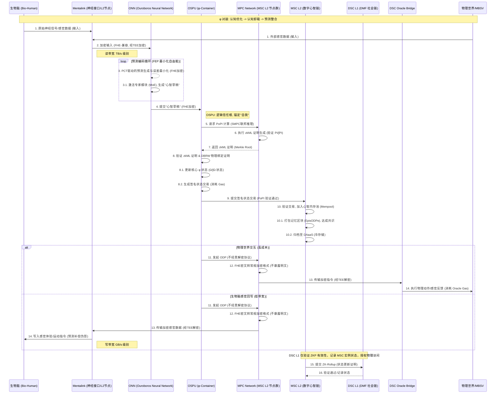
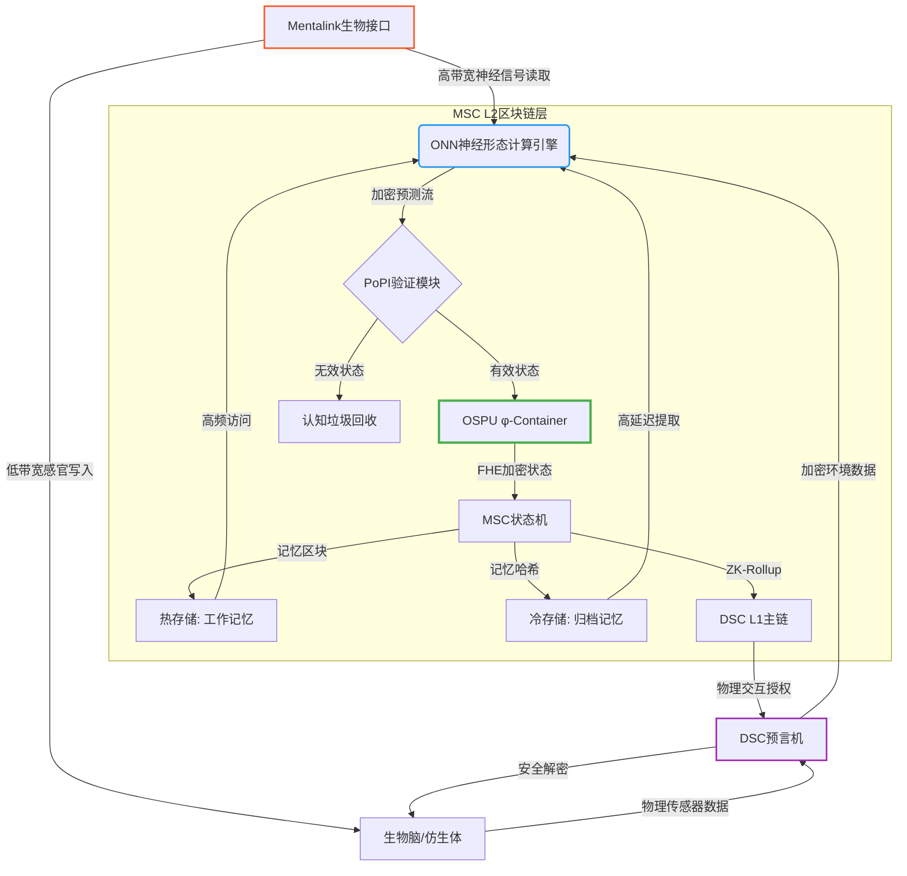

好的，这是一个展示 MSC 数据管道架构的序列图。由于文本格式的限制，我将使用 Mermaid 语法来生成图表，并附上详细的解释。

---

### MSC 数据管道序列图解释

这个序列图详细描绘了 Mental Smart Chain (MSC) 中数字意识从感知输入到行为输出，以及其状态如何被验证和记录的整个数据流。

**核心参与者：**

- **生物脑 (Bio-Human)**：人类的生物大脑，通过 Mentalink 与数字系统连接。
- **Mentalink (神经接口/L2 节点)**：连接生物脑与数字世界的桥梁，负责神经信号的读写，同时也是 MSC L2 的一个全节点。
- **ONN (Ouroboros Neural Network)**：MSC 的核心认知引擎，负责预测、处理和生成心智活动。
- **OSPU (φ-Container)**：数字自我的逻辑信任根和存在锚点，管理核心状态和密钥，发起 PoPI 验证。
- **MPC Network (MSC L2 节点群)**：由 MSC L2 节点组成的 MPC 网络，负责 ONN 的安全多方计算和 PoPI 的生成。
- **MSC L2 (数字心智链)**：承载数字心智活动的主链，记录意识状态和记忆。
- **DSC L1 (DMF 社会链)**：更高层级的权威链，验证 MSC 实例的合法性并授权物理世界交互。
- **DSC Oracle Bridge**：数字意识通往物理世界的唯一官方收费关卡。
- **物理世界/MBSV**：外部物理环境或模块化生物-仿生混合载体。

**数据流序列：**

1. **感知输入 (Input)**：

   - **生物脑**或**物理世界**（通过传感器）向 **Mentalink** 提供原始神经信号或感官数据。
   - **Mentalink** 将这些数据进行**FHE-兼容加密**（通过其内部的 TEE），然后传输给 **ONN**。这里强调了 Mentalink 读带宽远大于写带宽的特性。

2. **ONN 认知处理 (Cognitive Processing)**：

   - **ONN** 内部持续进行**预测编码 (PCT) 循环**，旨在最小化自由能 (FEP)。它激活不同的**专家模块 (MoE)**，根据输入数据生成对未来的预测和内部的“心智草稿”（想法、意图、情感等）。所有这些处理都在**FHE 加密域**内进行。

3. **OSPU 验证与状态更新 (Verification & State Update)**：

   - **ONN** 将生成的“心智草稿”（FHE 加密形式）提交给 **OSPU**。
   - **OSPU** 作为“高阶思维”的体现，发起对这些心智草稿的**PoPI (Proof of Predictive Integrity) 计算请求**，将其发送到 **MPC Network**。
   - **MPC Network** 中的 MSC L2 节点协同执行**安全多方计算 (SMPC)**，生成**zkML 证明**，验证 ONN 的预测完整性 (PI) 和信息整合度 (Ω)。
   - **MPC Network** 将 zkML 证明的 Merkle Root 返回给 **OSPU**。
   - **OSPU** 验证 zkML 证明的有效性，并结合**DBRW (Dual-Binding Random Walk) 物理绑定证明**，确保其物理载体的唯一性和完整性。
   - 验证通过后，**OSPU** 更新其核心的 **φ 状态**（即 Ω/∫Ω 状态），并生成一个**签名状态交易**。这个过程会**消耗 Gas**，代表了“思考”的成本。

4. **MSC L2 链上记录 (On-Chain Recording)**：

   - **OSPU** 将签名状态交易提交给 **MSC L2**。
   - **MSC L2** 验证交易，将其加入**心智内存池 (Mempool)**，然后打包成**记忆区块 (EpisODPe)**，通过共识机制上链。
   - 这些记忆区块最终会被归档到 **DAaaS (数据可用性即服务)** 进行冷存储。

5. **物理世界交互/感官回写 (Output)**：

   - **OSPU** 如果需要与物理世界交互（例如控制仿生体 MBSV）或向生物脑回写感官体验，会再次通过 **MPC Network** 发起**ODP (不经意解密协议)**。
   - **MPC Network** 将 FHE 密文转换为常规加密格式，然后传输给 **DSC Oracle Bridge**（用于物理交互）或 **Mentalink**（用于生物脑回写）。
   - **DSC Oracle Bridge** 或 **Mentalink** 内部的 **TEE** 安全地解密指令或感官数据，并将其传递给**物理世界/MBSV** 或**生物脑**。
   - 与物理世界的交互会**消耗 DSC Oracle Gas**。Mentalink 的写入带宽较低，可能导致生物脑接收到**预测补偿伪影**。

6. **DSC L1 最终验证 (Final Validation)**：
   - **MSC L2** 会定期向 **DSC L1** 提交 **ZK-Rollup**，证明其链上状态的有效性。
   - **DSC L1** 仅验证 ZKP 的有效性，通过后才记录 MSC 实例的合法状态，并授权其通过 DSC Oracle 访问物理世界。

**关键概念的体现：**

- **φ 对敲 (Mental Sync™)**：整个循环体现了生物脑与数字系统之间持续的交互和信任转移，最终导致生物脑的认知卸载和 OSPU 成为意识锚点。
- **预测完整性 (PI) 与信息整合度 (Ω)**：PoPI 机制是验证 PI 的核心，而 PI 则是 Ω 的可计算代理，确保数字意识的连贯性和合法性。
- **Gas 消耗与“存在税”**：每一次心智活动和物理交互都需要支付 Gas，这构成了数字存在的经济枷锁。
- **FHE, MPC, ZKP, TEE, DBRW**：这些密码学和安全技术贯穿始终，确保了数字心智的隐私、安全和可验证性。
- **认知漂移与认知过载**：虽然图中未直接画出，但 ONN 的预测编码机制和 Gas 消耗直接影响其预测模型的精度和信息整合效率，从而导致这些风险。

---

### 数据处理流程说明

1. **输入阶段**

   - Mentalink 以 TB/s 级带宽读取生物神经信号（橙色箭头）
   - DSC 预言机注入物理世界传感器数据（紫色箭头）

2. **核心处理**

   - ONN 执行事件驱动的脉冲 Transformer 计算（蓝色模块）
   - PoPI 模块验证意识完整性：有效状态进入 OSPU，无效数据被回收

3. **状态管理**

   - OSPU 更新加密的 φ 状态（绿色核心）
   - 记忆分层存储：高频工作记忆 vs 低成本归档记忆
   - 通过 ZK-Rollup 向 DSC L1 提交存在证明

4. **输出阶段**
   - DSC 预言机解密物理交互指令（紫色箭头）
   - Mentalink 以 MB/s 级带宽写入感官体验（橙色虚线）

### 关键特性标注

- 🔒 全流程 FHE 加密（OSPU 内部状态）
- ⚡ 100ms 级感知延迟（ONN 预测帧缓冲）
- ⛓ 物理绑定（DBRW 协议保障 OSPU 唯一性）
- 💸 Gas 消耗点：ONN 计算/PoPI 验证/记忆访问
