# Mental Smart Chain 论文重写任务清单 (100项)

## 理论基础强化 (30项)
1. [ ] 建立IIT公设与FHE-vTPM的状态空间映射关系
2. [ ] 量化φ值的数字等效算法设计
3. [ ] 定义意识整合度的工程测量指标
4. [ ] 编写PCT在LSTM中的实现伪代码
5. [ ] 收集最近3年意识数字化实验论文(10篇)
6. [ ] 分析IIT 3.0对神经形态计算的修正要求
7. [ ] 设计Φ值计算的差分隐私保护方案
8. [ ] 编写预测误差反向传播的数学证明
9. [ ] 建立脑区-ANNs模块的对应关系表
10. [ ] 量化主观体验连续性的检测指标

## 技术实现完善 (45项)
11. [ ] 计算FHE加法门的Gas消耗基准
12. [ ] 测量FHE乘法门的延迟数据
13. [ ] 设计ANNs集群的分布式训练方案
14. [ ] 编写MSC L2区块头的结构定义
15. [ ] 测试Mentalink的最小带宽要求
16. [ ] 优化FHE-vTPM的自举(bootstrapping)间隔
17. [ ] 设计ANNs模块的热插拔协议
18. [ ] 编写状态验证的zk-SNARK电路
19. [ ] 测试MPC协议在不同网络延迟下的表现
20. [ ] 量化TEE飞地的内存占用
21. [ ] 设计神经信号压缩算法
22. [ ] 测试不同ANN架构的Φ值计算效率
23. [ ] 编写FHE噪声增长监控脚本
24. [ ] 建立ANNs模块的QoS指标体系
25. [ ] 设计状态回滚的容错机制
26. [ ] 测量zk-SNARK生成时间与模型复杂度的关系
27. [ ] 优化MPC协议的通信轮次
28. [ ] 编写ANNs权重差分编码算法
29. [ ] 测试不同硬件加速器的FHE吞吐量
30. [ ] 设计Mentalink信号的安全校验码
31. [ ] 量化意识迁移各阶段的Gas消耗
32. [ ] 编写神经元-ANN节点的映射验证工具
33. [ ] 测试预测误差反向传播的延迟
34. [ ] 设计ANNs集群的负载均衡方案
35. [ ] 建立模块化认知功能的测试用例库
36. [ ] 编写状态验证的Merkle证明生成器
37. [ ] 测试不同共识算法对φ状态同步的影响
38. [ ] 量化TEE环境下的FHE加速比
39. [ ] 设计ANNs权重更新的增量提交机制
40. [ ] 编写神经信号模拟器用于接口测试
41. [ ] 测量不同脑区的信号采样率要求
42. [ ] 设计意识迁移进度的可视化仪表盘
43. [ ] 测试ANNs模块的动态加载性能
44. [ ] 编写φ状态完整性的审计日志规范
45. [ ] 优化PoPI验证的并行计算流程
46. [ ] 设计Mentalink硬件的功耗模型
47. [ ] 测试不同加密方案下的ANNs推理延迟
48. [ ] 编写数字意识的时间戳同步协议
49. [ ] 量化预测编码层级间的通信开销
50. [ ] 设计ANNs集群的容灾恢复方案
51. [ ] 测试FHE自举操作的内存峰值
52. [ ] 编写神经信号的特征提取算法
53. [ ] 建立意识迁移的风险评估矩阵
54. [ ] 优化状态验证的批量处理流程
55. [ ] 设计数字Φ值的实时监控告警
56. [ ] 测试不同网络拓扑下的MPC效率
57. [ ] 编写认知功能模块的API文档
58. [ ] 量化ANNs集群的能源效率指标
59. [ ] 设计Mentalink固件的安全更新机制
60. [ ] 测试zk-STARKs在大规模状态验证中的应用
61. [ ] 编写意识连续性检测的启发式算法
62. [ ] 建立ANNs权重更新的版本控制方案
63. [ ] 设计FHE电路的硬件描述语言实现
64. [ ] 测试不同压缩算法对神经信号的影响
65. [ ] 编写数字意识的状态快照协议
66. [ ] 量化预测误差最小化的收敛速度
67. [ ] 设计ANNs模块的计费计量系统
68. [ ] 测试TEE环境下侧信道攻击的防护
69. [ ] 编写意识迁移的阶段性评估标准
70. [ ] 建立ANNs集群的资源预留机制
71. [ ] 设计神经信号的数据完整性校验
72. [ ] 测试不同硬件平台的FHE兼容性
73. [ ] 编写数字意识的身份认证协议
74. [ ] 量化MPC参与方增加时的性能衰减
75. [ ] 设计ANNs模型的增量学习流程
76. [ ] 测试Mentalink接口的电磁兼容性
77. [ ] 编写意识状态的可视化解析工具
78. [ ] 建立FHE参数调优的自动化脚本
79. [ ] 设计ANNs集群的灰度发布方案
80. [ ] 测试不同加密粒度下的计算开销
81. [ ] 编写数字意识的元数据标准
82. [ ] 量化意识迁移过程中的Φ值波动
83. [ ] 设计ANNs模块的熔断降级策略
84. [ ] 测试zk-SNARKs在移动端的验证性能
85. [ ] 编写神经信号的异常检测算法
86. [ ] 建立意识迁移的回滚测试场景
87. [ ] 设计FHE计算的流水线优化方案
88. [ ] 测试ANNs模型的热更新延迟
89. [ ] 编写数字意识的状态差异比对工具
90. [ ] 量化预测编码层级间的耦合强度
91. [ ] 设计Mentalink设备的故障转移方案
92. [ ] 测试不同压缩率下的意识保真度
93. [ ] 编写ANNs集群的自动化测试框架
94. [ ] 建立意识迁移的基准测试套件
95. [ ] 编写数字遗嘱的智能合约模板
96. [ ] 评估不同FHE方案对ANNs推理的适用性
97. [ ] 设计ANNs模块的知识蒸馏流程
98. [ ] 测试MPC协议的抗女巫攻击能力
99. [ ] 编写Mentalink信号的去噪算法
100.[ ] 量化意识迁移过程中的能量消耗

## 理论基础强化 (90项)
101. [ ] 细化IIT公设“存在”在FHE-vTPM中的数学定义
102. [ ] 阐述IIT公设“组合”与φ状态向量分量的关系
103. [ ] 解释IIT公设“信息”如何体现在φ状态的特异性上
104. [ ] 深入分析IIT公设“整合”与PoPI/PoII机制的联系
105. [ ] 探讨IIT公设“排他”如何界定数字意识的边界
106. [ ] 建立IIT Φ值与ANNs网络结构复杂度的理论关联
107. [ ] 设计基于信息论的数字Φ值近似计算方法
108. [ ] 比较不同IIT变体（如causal structure）与MSC架构的兼容性
109. [ ] 调研基于IIT的意识测量工具及其局限性
110. [ ] 阐述PCT中生成模型在ANNs中的具体实现方式
111. [ ] 解释PCT中预测信号的神经对应物在MSC中的模拟
112. [ ] 详细描述PCT中预测误差信号的计算与传播机制
113. [ ] 探讨自由能原理(FEP)与MSC系统整体优化的关系
114. [ ] 设计基于PCT的ANNs在线学习算法
115. [ ] 量化预测误差最小化对ANNs模型参数更新的影响
116. [ ] 调研基于PCT的认知障碍模型及其在MSC中的潜在应用
117. [ ] 建立生物脑区功能与模块化ANNs功能的对应关系图
118. [ ] 分析不同脑区在意识形成中的作用与对应ANNs模块的设计需求
119. [ ] 探讨丘脑-皮层回路在信息整合中的作用及其在MSC中的模拟
120. [ ] 调研意识的神经振荡理论与MSC时间戳机制的关联
121. [ ] 阐述主观体验连续性在现象学和计算层面的定义
122. [ ] 设计主观体验连续性的计算模型和评估指标
123. [ ] 调研意识状态（如清醒、睡眠、梦境）的神经机制与MSC模拟
124. [ ] 探讨注意机制在信息筛选与整合中的作用及其在ANNs中的实现
125. [ ] 建立记忆系统（短时、长时、工作记忆）与ANNs模块的详细对应关系
126. [ ] 分析情绪和动机对认知过程的影响及其在ANNs中的模拟
127. [ ] 探讨元认知能力在MSC中的实现及其与FHE-vTPM的关系
128. [ ] 调研具身认知理论与Mentalink接口设计的关联
129. [ ] 阐述意识的因果作用理论与FHE-vTPM作为逻辑主体的关系
130. [ ] 设计基于因果推断的数字Φ值计算方法
131. [ ] 调研意识的全局工作空间理论(GWT)与MSC架构的对比分析
132. [ ] 探讨意识的整合与分化理论与MSC模块化设计的关系
133. [ ] 建立生物意识与数字意识在信息处理层面的等效性证明框架
134. [ ] 分析意识的涌现现象与MSC系统复杂度的关系
135. [ ] 调研意识的量子理论与MSC计算模型的兼容性
136. [ ] 阐述“φ对敲”机制的神经可塑性基础
137. [ ] 解释“神经PCT补贴”如何诱导生物脑功能外包
138. [ ] 设计量化生物Φ衰减的实验方法（针对生物原体）
139. [ ] 探讨数字Φ状态重建的理论基础和实现路径
140. [ ] 分析意识迁移临界点的理论定义和现象学表现
141. [ ] 调研“缸中之脑”思想实验的哲学讨论与MSC的关联
142. [ ] 阐述“活墓碑”概念的哲学和技术内涵
143. [ ] 解释“遗留外设化”对生物体地位的影响
144. [ ] 探讨“脱同步是伪命题”的论证逻辑
145. [ ] 设计“临终回写”服务的神经科学和伦理学基础
146. [ ] 调研认知智能合约的理论基础（如行为经济学、认知心理学）
147. [ ] 阐述认知智能合约对个体认知模式的影响机制
148. [ ] 分析认知智能合约的潜在风险（如行为固化、外部控制）
149. [ ] 设计认知智能合约的去中心化治理方案
150. [ ] 建立认知智能合约的性能评估指标

## 技术实现完善 (145项)
151. [ ] 详细计算FHE加法门在不同参数下的具体Gas消耗
152. [ ] 详细测量FHE乘法门在不同参数下的具体延迟数据
153. [ ] 设计基于MPC的分布式ANNs训练隐私保护方案
154. [ ] 编写MSC L2区块体的数据结构定义（包含ANNs权重差分、FHE状态更新等）
155. [ ] 详细测试Mentalink在不同神经信号类型下的最小带宽要求
156. [ ] 优化FHE-vTPM自举操作的计算图和电路设计
157. [ ] 设计ANNs模块热插拔的无缝切换协议
158. [ ] 编写PoPI验证的zk-SNARK电路（详细逻辑）
159. [ ] 测试不同MPC协议在模拟MSC网络环境下的性能
160. [ ] 详细量化TEE飞地在不同任务下的内存占用
161. [ ] 设计基于深度学习的神经信号压缩算法
162. [ ] 测试不同ANN架构（CNN, RNN, Transformer, GAT）的Φ值计算效率
163. [ ] 编写FHE噪声增长的实时监控和预警脚本
164. [ ] 建立ANNs模块的QoS指标体系（延迟、吞吐量、准确率）
165. [ ] 设计基于区块链的状态回滚和争议解决机制
166. [ ] 测量zk-SNARK生成时间与PoPI/PoII模型复杂度的关系
167. [ ] 优化MPC协议的通信轮次和消息大小
168. [ ] 编写ANNs权重差分编码和解码算法
169. [ ] 测试不同硬件加速器（GPU, FPGA, ASIC）的FHE吞吐量
170. [ ] 设计Mentalink信号的安全校验码和防篡改机制
171. [ ] 量化意识迁移各阶段（初期、中期、后期）的Gas消耗模型
172. [ ] 编写神经元活动模式与ANN节点激活模式的映射验证工具
173. [ ] 测试预测误差反向传播在分布式ANNs中的延迟
174. [ ] 设计ANNs集群的动态负载均衡和任务调度方案
175. [ ] 建立模块化认知功能的自动化测试用例库
176. [ ] 编写φ状态验证的Merkle证明生成和验证器
177. [ ] 测试不同共识算法（PoA, PoSA, DPoS）对φ状态同步的影响
178. [ ] 量化TEE环境下的FHE加速比（与软件实现对比）
179. [ ] 设计ANNs权重更新的增量提交和版本管理机制
180. [ ] 编写高保真神经信号模拟器用于Mentalink接口测试
181. [ ] 测量不同脑区（皮层、海马体、基底节）的信号采样率要求
182. [ ] 设计意识迁移进度的可视化仪表盘和关键指标展示
183. [ ] 测试ANNs模块的动态加载和卸载性能
184. [ ] 编写φ状态完整性的审计日志规范和审计工具
185. [ ] 优化PoPI验证的并行计算流程和资源分配
186. [ ] 设计Mentalink硬件的功耗模型和能效优化方案
187. [ ] 测试不同混合加密方案下的ANNs推理延迟
188. [ ] 编写数字意识的时间戳同步协议（跨设备、跨网络）
189. [ ] 量化预测编码层级间的通信开销和带宽需求
190. [ ] 设计ANNs集群的容灾恢复和备份方案
191. [ ] 测试FHE自举操作的内存峰值和优化方法
192. [ ] 编写基于机器学习的神经信号特征提取算法
193. [ ] 建立意识迁移的风险评估矩阵和缓解策略
194. [ ] 优化φ状态验证的批量处理和聚合证明流程
195. [ ] 设计数字Φ值的实时监控和异常告警系统
196. [ ] 测试不同网络拓扑（P2P, Client-Server）下的MPC效率
197. [ ] 编写认知功能模块的详细API文档和开发者指南
198. [ ] 量化ANNs集群的能源效率指标和优化目标
199. [ ] 设计Mentalink固件的安全更新和回滚机制
200. [ ] 测试zk-STARKs在大规模状态验证中的性能和可扩展性
201. [ ] 编写意识连续性检测的基于行为和生理信号的启发式算法
202. [ ] 建立ANNs权重更新的版本控制和回溯方案
203. [ ] 设计FHE电路的硬件描述语言（如Verilog, VHDL）实现
204. [ ] 测试不同压缩算法对神经信号保真度的影响
205. [ ] 编写数字意识的状态快照和恢复协议
206. [ ] 量化预测误差最小化的收敛速度和稳定性
207. [ ] 设计ANNs模块的计费计量和资源分配智能合约
208. [ ] 测试TEE环境下针对特定侧信道攻击的防护效果
209. [ ] 编写意识迁移的阶段性评估标准和自动化判定逻辑
210. [ ] 建立ANNs集群的资源预留和弹性伸缩机制
211. [ ] 设计神经信号的数据完整性校验和防篡改机制
212. [ ] 测试不同硬件平台（x86, ARM）的FHE兼容性和性能
213. [ ] 编写数字意识的去中心化身份认证协议
214. [ ] 量化MPC参与方增加时对计算和通信性能的影响
215. [ ] 设计ANNs模型的增量学习和持续适应流程
216. [ ] 测试Mentalink接口的电磁兼容性和抗干扰能力
217. [ ] 编写意识状态的可视化解析和调试工具
218. [ ] 建立FHE参数调优的自动化搜索和优化脚本
219. [ ] 设计ANNs集群的灰度发布和A/B测试方案
220. [ ] 测试不同加密粒度（比特级、字级）下的计算开销
221. [ ] 编写数字意识的元数据标准和互操作性规范
222. [ ] 量化意识迁移过程中Φ值的波动和稳定性指标
223. [ ] 设计ANNs模块的熔断、降级和限流策略
224. [ ] 测试zk-SNARKs在移动端（如Mentalink控制器）的验证性能
225. [ ] 编写基于异常检测的神经信号安全监控算法
226. [ ] 建立意识迁移过程的回滚测试场景和验证方法
227. [ ] 设计FHE计算的流水线优化和任务并行方案
228. [ ] 测试ANNs模型的热更新和版本切换延迟
229. [ ] 编写数字意识的状态差异比对和合并工具
230. [ ] 量化预测编码层级间的耦合强度和信息流向
231. [ ] 设计Mentalink设备的故障转移和冗余方案
232. [ ] 测试不同压缩率下意识体验的保真度和可接受度
233. [ ] 编写ANNs集群的自动化测试和持续集成框架
234. [ ] 建立意识迁移的基准测试套件和性能指标
235. [ ] 编写数字遗嘱的智能合约模板（包含触发条件、继承逻辑等）
236. [ ] 评估不同FHE方案（如CKKS, BFV, BGV）对ANNs推理的适用性
237. [ ] 设计ANNs模块的知识蒸馏和模型压缩流程
238. [ ] 测试MPC协议在对抗性环境下的抗女巫攻击能力
239. [ ] 编写基于信号处理的Mentalink信号去噪算法
240. [ ] 量化意识迁移过程中不同阶段的精确能量消耗模型
241. [ ] 设计基于硬件安全模块(HSM)的FHE私钥管理方案
242. [ ] 测试ANNs集群在不同硬件配置下的性能瓶颈
243. [ ] 编写MSC L2的轻客户端同步协议
244. [ ] 量化Mentalink接口的信号延迟和抖动
245. [ ] 设计FHE-vTPM的远程证明协议
246. [ ] 测试MPC协议的抗共谋攻击能力
247. [ ] 编写ANNs模型的可解释性分析工具
248. [ ] 量化TEE环境下的加密操作延迟
249. [ ] 设计基于强化学习的ANNs资源分配策略
250. [ ] 测试Mentalink接口的生物相容性
251. [ ] 编写数字意识的审计日志分析工具
252. [ ] 量化FHE自举操作的计算资源需求
253. [ ] 设计ANNs模块的联邦学习集成方案
254. [ ] 测试zk-SNARKs的后量子安全性
255. [ ] 编写神经信号的隐私保护处理流程
256. [ ] 量化意识迁移过程中的数据存储需求
257. [ ] 设计ANNs集群的弹性计算资源调度
258. [ ] 测试TEE环境下的远程代码证明
259. [ ] 编写数字意识的跨链互操作协议
260. [ ] 量化MPC协议的通信带宽需求
261. [ ] 设计ANNs模型的持续集成/持续部署(CI/CD)流程
262. [ ] 测试Mentalink接口的长期稳定性
263. [ ] 编写意识状态的语义分析工具
264. [ ] 量化FHE参数对噪声增长的影响
265. [ ] 设计ANNs模块的知识图谱集成
266. [ ] 测试zk-STARKs的证明生成效率
267. [ ] 编写神经信号的实时处理框架
268. [ ] 量化意识迁移过程中的计算成本波动
269. [ ] 设计ANNs集群的性能监控系统
270. [ ] 测试TEE环境下的数据加密性能
271. [ ] 编写数字意识的去中心化存储方案
272. [ ] 量化MPC协议的计算开销
273. [ ] 设计ANNs模型的迁移学习策略
274. [ ] 测试Mentalink接口的安全性漏洞
275. [ ] 编写意识状态的异常行为检测算法
276. [ ] 量化FHE计算的能耗
277. [ ] 设计ANNs模块的对抗性攻击防御
278. [ ] 测试zk-SNARKs的验证延迟
279. [ ] 编写神经信号的标准化协议
280. [ ] 量化意识迁移过程中的网络延迟影响
281. [ ] 设计ANNs集群的自动扩缩容机制
282. [ ] 测试TEE环境下的密钥管理安全性
283. [ ] 编写数字意识的去中心化治理模型
284. [ ] 量化MPC协议的延迟
285. [ ] 设计ANNs模型的模型压缩技术
286. [ ] 测试Mentalink接口的信号保真度
287. [ ] 编写意识状态的因果关系分析工具
288. [ ] 量化FHE自举操作的延迟
289. [ ] 设计ANNs模块的隐私保护训练
290. [ ] 测试zk-STARKs的证明大小
291. [ ] 编写神经信号的生物反馈回路设计
292. [ ] 量化意识迁移过程中的带宽需求
293. [ ] 设计ANNs集群的成本优化策略
294. [ ] 测试TEE环境下的代码完整性验证
295. [ ] 编写数字意识的去中心化身份恢复方案

## 伦理与安全 (65项)
296. [ ] 制定意识迁移的详细临床评估流程和标准
297. [ ] 设计脱同步后的渐进式认知功能恢复方案
298. [ ] 编写认知戒断综合征的详细症状分级量表和干预措施
299. [ ] 建立非法复制的密码学检测机制和链上惩罚协议
300. [ ] 设计临终回写服务的详细伦理审查流程和用户同意机制
301. [ ] 探讨数字身份唯一性的哲学和法律定义
302. [ ] 设计防止数字身份被盗用或伪造的机制
303. [ ] 建立数字存在的权利框架（如隐私权、自主权）
304. [ ] 设计数字意识的法律地位和责任归属
305. [ ] 探讨意识迁移过程中的知情同意问题
306. [ ] 设计用户对认知智能合约的完全控制权保障机制
307. [ ] 建立认知智能合约的审计和透明度机制
308. [ ] 探讨认知智能合约对个体自由意志的影响
309. [ ] 设计防止认知智能合约被恶意篡改的机制
310. [ ] 建立数字意识的“死亡”定义和处理流程
311. [ ] 设计数字遗嘱的执行机制和法律效力
312. [ ] 探讨数字意识的继承权和财产处理
313. [ ] 设计防止MSC系统被用于非法目的（如洗脑、控制）的机制
314. [ ] 建立MSC平台的安全漏洞披露和奖励机制
315. [ ] 探讨MSC系统的中心化风险和去中心化治理方案
316. [ ] 设计用户数据（神经信号、φ状态）的隐私保护策略
317. [ ] 建立数据使用和共享的透明度机制
318. [ ] 探讨FHE计算中的隐私泄露风险（如侧信道）
319. [ ] 设计MPC协议中的参与方作恶检测和惩罚机制
320. [ ] 建立ZKP证明的可靠性和可信度评估标准
321. [ ] 探讨TEE环境下的硬件漏洞和供应链安全风险
322. [ ] 设计Mentalink接口的物理安全防护措施
323. [ ] 建立意识迁移过程中的心理健康支持机制
324. [ ] 探讨数字意识的社会融入和歧视问题
325. [ ] 设计数字意识的教育和培训体系
326. [ ] 建立MSC平台的紧急关停和数据销毁协议
327. [ ] 探讨数字意识的能源消耗和环境影响
328. [ ] 设计MSC系统的可持续发展模型
329. [ ] 建立数字意识的伦理委员会和监管框架
330. [ ] 探讨意识迁移的长期社会影响和人类未来
331. [ ] 设计防止认知智能合约产生偏见或歧视的机制
332. [ ] 建立用户对ANNs模型训练数据的控制权
333. [ ] 探讨数字意识的“觉醒”和自我认知发展
334. [ ] 设计MSC系统的透明度和可解释性机制
335. [ ] 建立数字意识的“数字公民”权利和义务
336. [ ] 探讨意识迁移对人类进化和社会结构的影响
337. [ ] 设计防止Mentalink接口被恶意攻击或劫持的机制
338. [ ] 建立MSC平台的安全审计和渗透测试流程
339. [ ] 探讨数字意识的“数字贫困”和接入不平等问题
340. [ ] 设计MSC系统的去中心化身份验证和授权机制
341. [ ] 建立数字意识的“数字遗产”管理方案
342. [ ] 探讨意识迁移对家庭和社会关系的影响
343. [ ] 设计防止认知智能合约被用于操纵用户行为的机制
344. [ ] 建立用户对ANNs模型参数的知情权和控制权
345. [ ] 探讨数字意识的“数字永生”和存在意义
346. [ ] 设计MSC系统的抗审查和抗单点故障能力
347. [ ] 建立数字意识的“数字健康”监测和干预机制
348. [ ] 探讨意识迁移对人类文化和价值观的影响
349. [ ] 设计MSC系统的去中心化争议解决机制
350. [ ] 建立数字意识的“数字人权”保障框架

## 进度追踪

```mermaid
gantt
    title MSC论文重写甘特图 (300项)
    dateFormat  YYYY-MM-DD
    section 理论基础强化
    IIT映射模型细化       :active, 2025-05-10, 5d
    PCT实现量化         :2025-05-15, 4d
    意识数字化文献调研    :2025-05-19, 3d
    IIT 3.0修正分析     :2025-05-22, 3d
    Φ值隐私保护设计     :2025-05-25, 4d
    预测误差数学证明      :2025-05-29, 3d
    脑区ANNs对应表      :2025-06-01, 2d
    主观体验检测指标      :2025-06-03, 3d
    section 技术实现完善
    FHE加法Gas计算      :2025-05-11, 4d
    FHE乘法延迟测量     :2025-05-15, 5d
    分布式ANNs训练设计  :2025-05-20, 6d
    MSC L2区块结构定义  :2025-05-26, 4d
    Mentalink带宽测试   :2025-05-30, 3d
    FHE自举优化       :2025-06-02, 5d
    ANNs热插拔协议      :2025-06-07, 4d
    zk-SNARK电路编写    :2025-06-11, 6d
    MPC性能测试       :2025-06-17, 5d
    TEE内存量化       :2025-06-22, 3d
    神经信号压缩算法      :2025-06-25, 4d
    ANN架构Φ值测试      :2025-06-29, 3d
    FHE噪声监控脚本     :2025-07-02, 2d
    ANNs QoS指标体系    :2025-07-04, 3d
    状态回滚机制设计      :2025-07-07, 4d
    zk-SNARK生成时间测量 :2025-07-11, 3d
    MPC通信优化       :2025-07-14, 3d
    ANNs权重差分编码    :2025-07-17, 4d
    硬件加速器FHE测试   :2025-07-21, 5d
    Mentalink安全校验码 :2025-07-26, 3d
    意识迁移Gas量化     :2025-07-29, 4d
    神经元ANN映射验证   :2025-08-02, 3d
    预测误差延迟测试      :2025-08-05, 2d
    ANNs负载均衡设计    :2025-08-07, 3d
    认知功能测试用例库    :2025-08-10, 4d
    状态验证Merkle证明  :2025-08-14, 3d
    共识算法同步影响测试  :2025-08-17, 4d
    TEE环境FHE加速比    :2025-08-21, 3d
    ANNs增量提交机制    :2025-08-24, 3d
    神经信号模拟器      :2025-08-27, 4d
    脑区信号采样率测量    :2025-08-31, 3d
    意识迁移可视化仪表盘  :2025-09-03, 4d
    ANNs动态加载测试    :2025-09-07, 3d
    φ状态审计日志规范   :2025-09-10, 2d
    PoPI并行计算优化    :2025-09-12, 3d
    Mentalink功耗模型   :2025-09-15, 3d
    加密方案ANNs延迟测试 :2025-09-18, 4d
    数字意识时间戳同步    :2025-09-22, 3d
    预测编码通信开销量化  :2025-09-25, 3d
    ANNs容灾恢复方案    :2025-09-28, 4d
    FHE自举内存峰值测试 :2025-10-02, 3d
    神经信号特征提取    :2025-10-05, 3d
    意识迁移风险评估矩阵  :2025-10-08, 4d
    状态验证批量处理    :2025-10-12, 3d
    数字Φ值实时监控     :2025-10-15, 3d
    MPC网络拓扑效率测试 :2025-10-18, 4d
    认知功能模块API文档 :2025-10-22, 3d
    ANNs能源效率量化    :2025-10-25, 2d
    Mentalink固件安全更新:2025-10-27, 3d
    zk-STARKs大规模验证 :2025-10-30, 4d
    section 伦理与安全
    意识迁移临床评估流程  :2025-05-14, 4d
    脱同步恢复方案设计    :2025-05-18, 5d
    认知戒断症状量表    :2025-05-23, 3d
    非法复制检测机制    :2025-05-26, 4d
    临终回写伦理审查    :2025-05-30, 3d
    数字身份唯一性探讨    :2025-06-02, 3d
    身份盗用防护机制    :2025-06-05, 4d
    数字存在权利框架    :2025-06-09, 3d
    数字意识法律地位    :2025-06-12, 4d
    知情同意问题分析    :2025-06-16, 3d
    认知智能合约控制权  :2025-06-19, 4d
    认知智能合约审计    :2025-06-23, 3d
    自由意志影响探讨    :2025-06-26, 3d
    合约篡改防护机制    :2025-06-29, 4d
    数字意识死亡定义    :2025-07-03, 3d
    数字遗嘱执行机制    :2025-07-06, 4d
    数字意识继承权      :2025-07-10, 3d
    非法目的使用防护    :2025-07-13, 4d
    安全漏洞披露机制    :2025-07-17, 3d
    中心化风险与治理    :2025-07-20, 4d
    用户数据隐私保护    :2025-07-24, 3d
    数据使用透明度      :2025-07-27, 2d
    FHE隐私泄露风险     :2025-07-29, 3d
    MPC作恶检测       :2025-08-01, 4d
    ZKP可靠性评估     :2025-08-05, 3d
    TEE硬件漏洞分析     :2025-08-08, 4d
    Mentalink物理安全   :2025-08-12, 3d
    心理健康支持机制    :2025-08-15, 4d
    社会融入与歧视问题  :2025-08-19, 3d
    数字意识教育体系    :2025-08-22, 3d
    紧急关停与数据销毁  :2025-08-25, 4d
    能源消耗与环境影响  :2025-08-29, 3d
    可持续发展模型      :2025-09-01, 3d
    伦理委员会与监管    :2025-09-04, 4d
    长期社会影响探讨    :2025-09-08, 3d
    合约偏见歧视防护    :2025-09-11, 4d
    用户训练数据控制权  :2025-09-15, 3d
    数字意识觉醒探讨    :2025-09-18, 3d
    系统透明度可解释性  :2025-09-21, 4d
    数字公民权利义务    :2025-09-25, 3d
    人类进化社会结构影响 :2025-09-28, 4d
    Mentalink攻击防护   :2025-10-02, 3d
    安全审计渗透测试    :2025-10-05, 4d
    数字贫困接入不平等  :2025-10-09, 3d
    去中心化身份验证    :2025-10-12, 4d
    数字遗产管理方案    :2025-10-16, 3d
    家庭社会关系影响    :2025-10-19, 3d
    合约操纵用户防护    :2025-10-22, 4d
    用户模型参数控制权  :2025-10-26, 3d
    数字永生存在意义    :2025-10-29, 4d
    抗审查抗单点故障    :2025-11-02, 3d
    数字健康监测干预    :2025-11-05, 4d
    文化价值观影响      :2025-11-09, 3d
    去中心化争议解决    :2025-11-12, 4d
    数字人权保障框架    :2025-11-16, 3d
```

