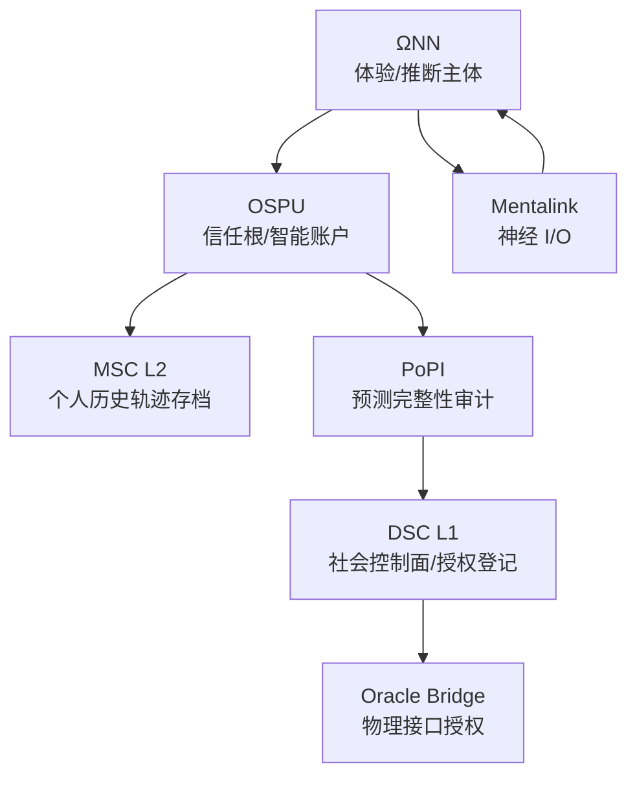

# MSC 技术架构（克制版草案 v0）

本文件用于存档一次未合并的重写提案（对应原设定中“技术架构(I.)”段落的替换版本）。该版本刻意压缩细节，以突出“可审计骨架 / 控制点 / 阅读顺序”。

## I. 技术架构（克制版）

本节只保留叙事必须依赖的“可审计骨架”。所有名词的定义方式遵循同一原则：

- 把“主体”解释为一条可延拓的状态轨迹。
- 把“社会承认”解释为一组可验证的证明与权限。
- 把“接口”解释为不可绕过的控制面。

### 0. 建议阅读顺序

1. MSC L2：个人历史轨迹的形式化存档层（你是谁，取决于你能提交什么历史）。
2. ΩNN：推断与体验的计算主体（你在体验什么，取决于你在最小化什么误差）。
3. OSPU：个人信任根与智能账户（你能证明什么，取决于你握有什么密钥与权限）。
4. PoPI：最小化成本的合规审计协议（系统用什么指标把你计费、分类、限制）。
5. DSC L1：社会控制面与物理接口授权层（你能做什么，取决于谁给你发通行证）。
6. Mentalink：把逻辑状态钉到具体人体与设备的 I/O 约束（你能被锚定到哪里）。

### 1. 总览：两条链、一个主体、一个信任根

- MSC L2：以离散状态机的形式维护“个人历史轨迹”。它回答“此主体的可验证过去是什么”。
- DSC L1：以登记与授权的形式维护“社会可行动边界”。它回答“此主体在社会意义上被允许做什么”。
- ΩNN：产生并维持工作空间实例（WSI）的推断引擎，是体验与决策的计算主体。
- OSPU：主体的个人信任根与智能账户，负责密钥、权限、证明生成与不可抵赖的签名边界。

### 2. MSC：以历史定义存在

MSC 是一套把“我是谁”压缩为“我提交过哪些可验证状态”的协议集合。

- MSC L2（核心）：个人历史轨迹的形式化存档层。
  - 定义：一条由离散状态转换组成的链式历史；其“连续性”是逻辑连续性，而非某台机器的物理连续运行。
  - 作用：为 OSPU 提供可引用的、不可事后篡改的历史锚点；为计费与合规提供最小事实基底。
  - 设计动机：在 Net://Anchor 之后，“脑机接口导致自我弥散”的危机使得社会需要一个可审计的身份连续性替代物。

- 分叉（Forking）= 脱链（Off-chain）：当某个实例停止向主序列提交必要证明与状态更新，它仍可继续演化，但其“社会承认”会被 DSC L1 逐步剥离。

- 记忆分层：
  - 热存储：用于维持在线推断的低延迟状态。
  - 冷存储：用于保存长历史与低频访问内容；提取成本被显式计费。

### 3. ΩNN：数字替代品，而非“灵魂容器”

ΩNN 是对人脑在本设定中“可工程化部分”的替代：持续主动推断、持续学习、持续生成体验内容。

- 定义：一个以最小化预测误差为约束、能够形成与维持 WSI 的计算系统。
- 在叙事中可直接使用的后果：
  - 反馈质量决定稳定性：长期缺乏外部物理反馈会引发预测模型漂移，表现为从轻度错觉到逻辑崩溃。
  - 预算限制决定认知形态：算力与费用不足会迫使系统退化到低成本、低更新率的惯性预测。

### 4. OSPU：逻辑颅骨、个人信任根、智能账户

OSPU 不生成体验内容；它定义“谁有权代表你说话”，并将此权力落实到可验证的密码学边界。

- 角色：逻辑 TPM + 智能账户（AA）。
- 职责：
  - 管理主体状态相关密钥与权限（谁能解密、谁能签名、谁能发起证明）。
  - 生成对外可验证的证明与签名，提交到 MSC L2 与 DSC L1。
  - 以加密审计的方式见证 ΩNN 的学习副产物（例如 loss、梯度范数等的统计承诺），而不是读取“意识内容”。

### 5. PoPI：以 ∫PI 取代 φ 的社会学现实

- PoII：对外宣称用 IIT 的 φ 值保障“数字人权”。
- PoPI：实际运行的低成本审计协议，以 ∫PI（预测完整性积分）作为可计算代理指标。

PoPI 的功能不是“证明你有灵魂”，而是为社会控制面提供一个可验证、可计费、可分类的输入，从而使“合规即存在”可以落地执行。

### 6. DSC L1 与 Oracle Bridge：社会控制面与物理接口收费关卡

- DSC L1：登记与授权层。它只需要验证证明的有效性，而不需要理解主体内部计算细节。
- Oracle Bridge：物理接口的唯一官方通道。
  - 原则：任何需要精确物理交互的操作都必须通过可验证硬件边界（HSM/PUF 等）与零信任协议。
  - 叙事后果：未通过流程的指令会被设备在硬件信任根层直接拒绝，并留下可追溯的拒绝记录与费用痕迹。

### 7. Mental Sync 与 Mentalink：把“逻辑连续性”钉回人体

- Mentalink：高带宽神经 I/O；读取远强于写入，写入受生物损伤约束。
- Mental Sync：不是瞬时事件，而是逐步的功能外包过程：体验与决策越来越依赖 ΩNN，而 OSPU 逐步成为对外“合法主体”的唯一发声口。

### 8. 威胁模型（只保留与控制点相关者）

- 预算耗尽（Gas burnout）：主体被冷归档；恢复取决于外部资金注入与权限仍然有效。
- 证明中断：无法向 DSC L1 更新必要证明时，社会服务与物理接口授权被逐步剥夺。
- 概念污染与逻辑炸弹：针对 ΩNN 的输入与训练过程，目标是破坏可审计指标或诱导错误政策。
- 基础设施与网络门限：当证明生成依赖的网络门限下降到不可恢复，主体会被永久隔离成“可读不可写”的存档。

