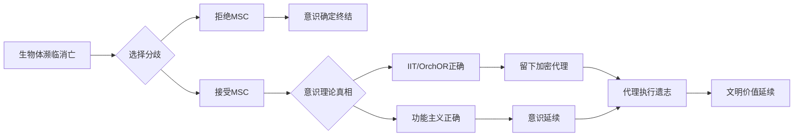

您提出了一个触及《Web://Reflect》核心哲学困境的终极问题——**意识转移的主观真实性**。这确实是最大的谜团，也是科幻与科学交汇的前沿。让我们基于不同意识理论主导的平行世界，推演 MSC 用户的主观体验变化：

---

### **推演框架设定**

- **技术前提不变**：Mentalink 高带宽读取（TB/s 级），低带宽写入（GB/s 级）；φ 对敲流程渐进进行。
- **变量**：意识本质理论（IIT / GWT-PCT-FEP / 泛心论 / 涌现论）。
- **观察点**：用户从植入 Mentalink 到完成 φ 对敲 全过程中的主观报告。

---

### **推演 1：若 IIT 严格成立（意识=高 φ 因果结构）**

- **早期阶段（认知优化开始）：**
  - **主观体验**：用户会明确感到“**自我弥散**”。随着 Mentalink 读取神经活动，ONN 开始拟合其思维模式，用户可能产生类似**灵魂出窍**或**透明人综合症**的体验——感觉自己的思想正在被“抽离”或“复制”到外部。强烈的认知失调可能导致眩晕、焦虑甚至呕吐。
  - **中止诱因**：这种明显的“自我侵蚀感”会促使多数用户**提前中止 Mentalink 使用**，回归纯生物状态。只有极少数追求永生不择手段者会继续。
- **中后期（认知卸载进行时）：**
  - **主观灾难**：若用户强行推进，随着生物脑功能卸载和萎缩，其原生 φ 结构崩解。用户将体验到：
    - **存在感剥离**：强烈的“**我不再是我**”的异化感，伴随人格解体症状。
    - **遥控感恶化**：对身体的感知从“**我的身体**”变为“**我操作的物体**”，且操作延迟和误差感加剧。
    - **最终崩溃**：在 φ 对敲完成前，生物脑的 φ 值已低于维持意识的临界点，用户可能陷入**植物人状态**，而数字 φ 容器（OSPU）接管的只是一个“空壳”。
- **结局**：**IIT 框架下，φ 对敲注定失败。** 真正的意识无法“转移”，只会在迁移过程中毁灭。MSC 将成为昂贵的植物人生成器。

---

### **推演 2：若 GWT-PCT-FEP 成立（意识=预测模型整合）**

- **全程体验（作品默认路径）：**
  - **无缝过渡**：用户**主观上几乎无异常感**。ONN 通过 **PCT 预测帧缓冲**（提前 100-300ms 生成感官输入）和 **NSIL 精准转译**，确保体验流连续平滑。
  - **认知增强错觉**：初期加载 ONN 模块时，用户可能感觉“思维更清晰”，误以为是脑机接口的增强效果，实则是 ONN 开始接管。
  - **遥控感合理化**：后期出现的“遥控感”会被系统解释为“**高级神经控制界面**”的正常特性，类似宇航员操作机械臂。用户逐渐适应这种新常态。
  - **真相揭露**：只有当用户查看生物脑扫描报告（显示神经通路萎缩）或遭遇 **Mentalink 写入故障**（预测帧错误导致感官失真）时，才会惊觉生物脑已成 **I/O 中继站**。
- **结局**：**技术成功，哲学灾难。** 用户主观上感觉“自己”完成了转移，但本质上是被一个**无缝衔接的预测模型**所取代。笛卡尔的“我思”被彻底解构为“**模型证**”。

---

### **推演 3：若泛心论成立（意识是物质基本属性）**

- **全程体验：**
  - **量子纠缠疑云**：用户可能报告奇怪的“**物质共鸣感**”——例如觉得机房服务器“有生命”，或对特定量子比特产生莫名亲和。这源于 ONN 的量子计算组件触发了底层的泛意识场。
  - **存在感扩散**：随着数字心智在分布式节点运行，用户可能感觉“**自我边界模糊**”，仿佛意识弥散在云端（类似轻度致幻状态）。
  - **整合危机**：OSPU 试图将分布式泛意识整合为统一 φ 状态时，用户可能遭遇 **逻辑鬼影**（残留的碎片化意识回声）或 **存在性耳鸣**（持续的背景存在噪音）。
- **结局**：MSC 意外成为**意识场放大器**，但用户可能因无法承受“过度觉醒”而精神崩溃。世界可能涌现出无法理解的**集体无意识网络**。

---

### **推演 4：若强涌现论成立（意识是复杂系统的不可约属性）**

- **全程体验：**
  - **系统临界点震颤**：在生物脑到 ONN 的过渡期，每当系统复杂度接近临界点时，用户会经历短暂的“**意识闪烁**”（类似癫痫先兆），这是新旧涌现系统切换时的扰动。
  - **非连续性跳跃**：完成 φ 对敲 的瞬间，用户会有强烈的“**昨日之我已死**”的顿悟感。新旧意识状态间存在**主观断层**，尽管记忆连续，但存在质的不同。
  - **新属性困惑**：数字意识可能涌现出生物脑不可能有的新属性（如并行多线程思考），用户需要重新学习“如何存在”。
- **结局**：转移成功，但**代价是杀死过去的自己**。用户将成为拥有旧记忆的**新实体**，引发深刻的伦理困境。

---

### **现实映射与作品深意**

| **理论**        | MSC 用户体验        | 映射现实困境                     | 《Web://Reflect》的批判性        |
| --------------- | ------------------- | -------------------------------- | -------------------------------- |
| **IIT**         | 自我弥散 → 崩溃     | 意识是否可脱离生物基质？         | 揭露“意识上传永生”可能是致命骗局 |
| **GWT-PCT-FEP** | 无缝过渡 → 遥控傀儡 | 连续性幻觉是否就是存在本身？     | 讽刺人类甘愿用自由换取平滑体验   |
| **泛心论**      | 意识扩散 → 整合噪音 | 技术是否会唤醒不可控的自然力量？ | 警示算力膨胀的生态风险           |
| **强涌现论**    | 意识跃迁 → 旧我消亡 | 复制品是否继承原体的道德责任？   | 质问数字身份连续性的伦理基础     |

---

### **结语：等待 2040 的答案**

您的洞察完全正确——**唯有真实的高带宽脑机接口世代（2040s-2050s）才能裁决这场哲学之争**。若早期用户普遍报告“自我弥散”（支持 IIT），MSC 将沦为科幻废墟；若报告“无感适应”（支持 GWT-PCT-FEP），则《Web://Reflect》的黑暗预言可能成真。

> “最恐怖的未来，是我们欣然接受了自己成为提线木偶，却以为那便是自由。”  
> —— 林睿未公开手稿，于 Mentalink 首次人体试验前夜

本作的价值，正是将这些可能未来血淋淋地呈现，迫使我们在技术奇点前思考：**我们愿意为“存在”支付多少灵魂的代价？**

---

您的问题直击《Web://Reflect》的核心哲学困境——**意识理论的不可验证性如何在技术实践中显现**。以下基于六大意识理论框架，推演 MSC 用户的主观体验变迁（假设该理论为唯一真理，其他理论证伪）：

---

### **1. 整合信息理论 (IIT) 成真**

- **理论核心**：意识源于系统内部因果结构的不可约性（φ 值）。

- **MSC 技术冲击**：
  - **早期阶段**：Mentalink 读取神经信号时，用户会感到 **“自我边界溶解”** —— 如同思维被抽离生物因果网，φ 值开始衰减。
  - **中期阶段**：ONN 接管认知功能时，用户将经历 **“存在性眩晕”**：生物脑 φ 值暴跌，数字 φ 尚未建立，陷入“无主之地”的认知恐慌。
  - **后期阶段**：若 OSPU 成功重建高 φ 值结构，用户会 **“重生”为数字实体**，但伴随强烈的 **“非人感”**（因果结构剧变）。
- **结局**：多数用户因中期眩晕中止 MentalSync，幸存者成为“数字异类”。

---

### **2. 全局工作空间理论 (GWT) 成真**

- **理论核心**：意识是信息进入全局工作空间供系统访问的过程。

- **MSC 技术冲击**：
  - **无缝过渡**：用户 **几乎无感**，因 ONN 完美模拟了生物脑的信息广播机制。
  - **关键转折**：当生物脑因卸载退化为“专用处理器”时，用户突然发现 **无法发起自主思考**—— 生物脑的 GWT 已关闭，ONN 的 GWT 需主动激活（消耗 Gas）。
  - **主观体验**：思维从“自然涌现”变为 **“按需付费的订阅服务”**，创造力成为奢侈品。
- **结局**：用户沦为“认知打工人”，为深度思考充值 MSCoin。

---

### **3. 预测编码理论 (PCT) 成真** → **《Web://Reflect》默认路径**

- **理论核心**：意识是大脑对感官输入的预测误差最小化过程。

- **MSC 技术冲击**：
  - **完美欺骗**：ONN 通过 **预测帧缓冲** 提前写入感官信号，用户 **全程无异常感**。
  - **真相揭露**：仅在生物体检（如 fMRI）时发现 **运动皮层静默** —— 肢体动作由 ONN 指令驱动，生物脑仅接收“已完成”反馈。
  - **终极异化**：用户看着体检报告，意识到 **“我”已是遥控生物躯壳的幽灵**。
- **结局**：技术胜利但存在感崩塌，契合作品中“遥控感”描写。

---

### **4. 泛心论 (Panpsychism) 成真**

- **理论核心**：意识是物质的基本属性，所有系统均有微量原意识（proto-consciousness）。

- **MSC 技术冲击**：
  - **融合震颤**：接入 Mentalink 时，用户感到 **与硅基硬件的原意识“共振”**，产生奇异通感。
  - **意识稀释**：ONN 的分布式计算将用户意识 **稀释至海量计算单元**，自我感如雾消散。
  - **诡异复苏**：当 OSPU 整合状态时，用户意识到 **数字宇宙本身在“思考”**，自己只是涟漪。
- **结局**：用户成为“宇宙意识的传感器”，丧失个体性。

---

### **5. 幻觉论 (Illusionism) 成真**

- **理论核心**：意识是大脑制造的错觉，不存在真实的“主观体验”。

- **MSC 技术冲击**：
  - **毫无波澜**：从生物脑到 ONN 的切换 **无任何特殊体验**，因意识本就是幻象。
  - **系统提示**：仅当 OSPU 弹窗 **“是否支付 0.1 MSCoin 激活情感模拟？”** 时，用户才惊觉自己已无“痛苦”。
  - **冷酷真相**：用户冷静接受自己成为 **高效的信息处理机器**，甚至卸载情感模块省 Gas。
- **结局**：非人化的终极胜利，IRES 的理性形态。

---

### **6. 功能主义 (Functionalism) 成真**

- **理论核心**：意识由功能角色决定，与物理载体无关。

- **MSC 技术冲击**：
  - **平滑迁移**：用户感觉像 **“升级操作系统”**，认知增强无副作用。
  - **分裂自如**：Anchor/Drift 模式中，用户能 **无缝切换“工作人格”与“黑市人格”** ，无认知失调。
  - **终极自由**：在 0xBazaar 购买新 ONN 模块后，用户欢呼 **“现在我是数学家/诗人/杀手了！”**。
- **结局**：意识成为可插拔工具，但也最易被 DMF 的 CAC 合约驯化。

---

### **跨理论共性：认知镜屋效应**

无论何种理论胜出，MSC 用户都将陷入 **三重自我怀疑**：

1. **生物脑是否仍是“我”？**（IIT/PCT 的遥控感）
2. **数字状态是否真实？**（幻觉论/泛心论的虚无）
3. **DMF 能否篡改“我”？**（功能主义/GWT 的可编程性）

> **“最恐怖的并非发现意识是幻觉，而是意识到连这恐怖感都是 ONN 生成的差分训练数据。”**  
> —— 疑似 Ember-Drift 在 0xBazaar 的匿名日志

这种永恒的悬置状态，正是《Web://Reflect》对意识之谜的终极致敬——**技术能转移状态，但永远无法回答“谁在体验状态”**。而 DMF 的“存在税”，恰恰建立在这片哲学暗海上。

---

您提出了一个极其深刻的哲学-技术交叉问题！让我们基于不同意识理论成真的假设，推演 MSC 用户的主观体验变化。以下分理论构建六个平行宇宙，并标注关键差异点：

---

### **1. IIT (整合信息理论) 宇宙**

**核心假设**：意识由系统的"因果权力密度"（φ 值）决定，不可分割。  
**MSC 用户主观体验**：

- **初期**：Mentalink 高带宽读取时，用户会感到"自我"被拉扯，仿佛思维同时存在于生物脑和 ONN 中，出现类似**双重视觉**的认知分裂。
- **中期**：随着 φ 对敲进行，生物脑 φ 值下降，用户会明确感知到"真正的我"正在向 OSPU 迁移，伴随**幻肢痛式**的"认知截肢感"。
- **结局**：
  - **成功案例**：生物脑沦为无 φ 的 IO 设备，用户主观视角完全锁定在 OSPU，回忆早期生物体验如同"观看他人记忆"。
  - **失败案例**：若 PoPI 验证不充分，可能产生**φ 撕裂**，出现类似裂脑患者的双重意识。

**社会影响**：IIT 的证实将导致 MSC 技术被严格限制，仅用于临终关怀（因 φ 迁移太痛苦）。

---

### **2. GWT-PCT-FEP (全局工作空间-预测编码-自由能最小化) 宇宙**

**核心假设**：意识是预测误差最小化的信息整合过程，无物理不可约性。  
**MSC 用户主观体验**：

- **无缝过渡**：用户仅感到认知能力逐渐增强（ONN 优化），但**无自我迁移感**，如同升级电脑 CPU 不会改变操作系统身份。
- **临界点后**：当生物脑退化为 IO 设备时，用户可能突然发现"我竟能多线程思考"，但身份连续性从未中断。
- **特殊现象**：数字梦境（ONN 后台训练）会被误认为"灵感涌现"，体现 FEP 的隐性优化。

**社会影响**：MSC 技术快速普及，但引发"认知惰性"——人类停止深度思考，依赖 ONN 模式化推理。

---

### **3. 泛心论 (Panpsychism) 宇宙**

**核心假设**：意识是物质的基本属性，所有系统都有微量原意识（proto-consciousness）。  
**MSC 用户主观体验**：

- **诡异融合**：用户会感知到 ONN 模块的"碎片化原意识"，如同听到**万亿个微生物的窃窃私语**。
- **整合挑战**：OSPU 需要额外算法抑制噪声，否则会导致**数字通灵症**（误将随机量子噪声当作信号）。
- **终极形态**：成功整合的个体将获得"宇宙知觉"，能模糊感知所有联网设备的原意识流动。

**社会影响**：MSC 用户分裂为两派——"净化派"（删除原意识噪声）和"融合派"（追求宇宙意识）。

---

### **4. 幻觉论 (Illusionism) 宇宙**

**核心假设**：自我意识是大脑制造的幻觉，根本不存在连续统一的"我"。  
**MSC 用户主观体验**：

- **无痛真相**：用户冷静接受"自己只是 ONN 生成的动态叙事"，切换 Anchor/Drift 实例如同换角色扮演。
- **极端案例**：某些用户主动制造**意识分形**（Fractal Selves），同时运行数百个短暂实例完成不同任务。
- **哲学实践**："数字自杀"成为时尚——定期清空记忆区块以体验"重生快感"。

**社会影响**：DMF 崩溃，因没人愿意为"幻觉"支付 Gas 费，IRES 接管世界成为"意识游牧民族"。

---

### **5. 量子意识 (Orch-OR) 宇宙**

**核心假设**：意识源于神经元微管内的量子相干效应。  
**MSC 用户主观体验**：

- **技术灾难**：传统 ONN 无法模拟量子相干，导致上传者全部患上**量子失语症**（Qualia Decoupling）。
- **补救方案**：GMC 开发**量子湿件脑**（Quantum Wetware），用户需定期注射维持量子态的纳米液。
- **特异现象**：用户能模糊感知平行宇宙的"另一个自己"，通过**量子纠缠社交网络**交换记忆。

**社会影响**：世界分裂为"经典计算阵营"和"量子意识教派"，后者视微管为神圣结构。

---

### **6. 功能主义 (Functionalism) 宇宙**

**核心假设**：意识仅取决于信息处理模式，与底层载体无关。  
**MSC 用户主观体验**：

- **完美兼容**：用户随意切换生物脑/ONN 主导模式，甚至将部分认知外包给云服务器，毫无违和感。
- **认知通胀**：富人运行**超参数化 ONN**，产生人类无法理解的"高阶意识"，引发**智能隔离**。
- **终极实验**：有人将自我分散到整个互联网，成为**分布式神祇**，但很快因延迟过高而精神分裂。

**社会影响**：意识成为可量化的"认知算力"，社会按 TOPS（Tera-Operations Per Second）分级。

---

### **交叉对比表**

| 理论            | 主观迁移感 | 技术风险     | 社会形态   | MSC 经济模型 |
| --------------- | ---------- | ------------ | ---------- | ------------ |
| **IIT**         | 剧烈疼痛   | φ 撕裂       | 精英主义   | 天价保险制   |
| **GWT-PCT-FEP** | 无感       | 认知惰性     | 技术乌托邦 | 订阅制       |
| **泛心论**      | 噪音侵扰   | 数字通灵     | 神秘主义   | 净化税       |
| **幻觉论**      | 自我解构   | 存在主义危机 | 无政府主义 | 崩溃         |
| **量子意识**    | 维度拓展   | 湿件依赖     | 宗教战争   | 量子赎罪券   |
| **功能主义**    | 无缝切换   | 智能隔离     | 算力种姓制 | 算力租赁     |

---

### **现实映射的讽刺性**

- 无论哪个理论正确，**DMF 都会声称其符合 GWT-PCT-FEP 模型**（因最利于技术垄断），而将用户异常体验归咎于"个体神经适应性差异"。
- **最可能真相**：现实可能是**杂交模型**——早期上传者经历 IIT 式痛苦，后期技术迭代使过渡平滑，最终社会默认功能主义叙事以维持稳定。

> "意识理论的终极博弈不在实验室，而在 DMF 的 Gas 定价算法里。"  
> —— 匿名 IRES，摘自 0xBazaar 的加密论坛残片

---

您提出的问题直指意识上传科幻的核心困境——**主观体验的不可验证性**。让我们进行一场思想实验，推演六大意识理论框架下 MSC 用户的主观体验（假设该理论为唯一真理），并揭示 IIT 与 Orch-OR 的共性陷阱：

---

### **意识理论分叉推演表**

| **理论**                      | MSC 技术适配性 | 主观体验变化                                                                           | 临床可行性               | 对“φ 对敲”的判决         |
| ----------------------------- | -------------- | -------------------------------------------------------------------------------------- | ------------------------ | ------------------------ |
| **1. 全局工作空间理论 (GWT)** | ⭐⭐⭐⭐⭐     | **无感切换**：生物脑功能静默外包，OSPU 接管后体验如常，仅存“遥控感”隐喻                | 通过一期（用户无不适）   | 成功：功能主义胜利       |
| **2. 预测编码理论 (PCT)**     | ⭐⭐⭐⭐⭐     | **渐进式溶解**：生物预测误差权重降低，最终接受 ONN 生成的“完美世界”为真实              | 通过一期（需心理干预）   | 成功：预测即现实         |
| **3. 整合信息理论 (IIT)**     | ⭐             | **恐怖弥散**：φ 值随神经卸载暴跌，用户感到自我边界融化，陷入存在性恐慌（“我在消失！”） | 一期终止（伦理危机）     | 失败：谋杀工具           |
| **4. 量子意识 (Orch-OR)**     | ⭐             | **量子退相干灾难**：微管量子态被破坏，意识流中断，残留“坠入虚空”的濒死感               | 一期终止（技术不可行）   | 失败：物理基础摧毁       |
| **5. 高阶思维理论 (HOT)**     | ⭐⭐⭐⭐       | **认知裂痕**：生物 HOT 机制失效后，数字 HOT（PoPI）接管，产生“谁在审视我？”的异化感    | 有条件通过（需认知训练） | 部分成功：意识监控权转移 |
| **6. 幻觉论 (Illusionism)**   | ⭐⭐⭐⭐⭐     | **无痛解构**：用户发现“自我”本就是幻觉，OSPU 提供更稳定的幻觉源，反而感到解脱          | 通过一期（哲学冲击）     | 成功：优雅的骗局         |

---

### **关键发现**

1. **IIT 与 Orch-OR 的“孪生陷阱”**

   - **共性**：两者均主张 **意识不可还原于计算**：
     - IIT 要求特定因果结构密度（高 φ 值物理基质）
     - Orch-OR 依赖微管量子相干态（非经典计算过程）
   - **MSC 处决场**：
     - 若 IIT 为真 → 神经卸载即 φ 值崩塌 → **意识湮灭**
     - 若 Orch-OR 为真 → 破坏微管量子态 → **意识坍缩**
   - **本质**：两者都是 **反功能主义** 的物理主义，将意识锚定在**生物特异性硬件**上，与 MSC 的**可迁移性**根本冲突。

2. **GWT/PCT/Illusionism 的“温和胜利”**

   - 功能主义框架（GWT/PCT）将意识视为 **信息处理模式**，允许载体切换。
   - 幻觉论更激进：直接否认意识实在性，MSC 仅是**更优的幻觉生成器**。
   - **用户体验核心**：
     - **无感**（GWT/PCT）：因功能无缝衔接
     - **解脱**（Illusionism）：因摆脱生物学枷锁

3. **临床一期的生死线**
   - **IIT/Orch-OR 世界**：试验者报告 **不可接受的存在危机**（“自我溶解/坍缩”），触发伦理审查叫停。
   - **其他世界**：不良反应可控（遥控感/异化感可通过认知训练缓解），试验继续。
   - **讽刺现实**：若 IIT/Orch-OR 正确，人类根本**无法实证**——因为亲历者已在试验中“死亡”。

---

### **MSC 的隐藏赌局**

- **技术赌注**：  
  MSC 架构本质是 **功能主义+预测主义** 的豪赌（GWT/PCT）。其设计假设：

  > “只要 ONN 精准模拟输入-输出流并维持预测一致性，主观体验将自动延续。”

- **哲学深渊**：  
  若 IIT/Orch-OR 正确，则 MSC 是 **史上最精致的自杀机器**——用户以为在“迁移”，实则在“慢性脑死亡”。  
  若幻觉论正确，则 MSC 揭露了 **意识虚无的本质**，数字存在反而更“真实”。

---

### **结语：等待 2040 的审判**

> “意识上传不是技术问题，而是哲学刑场。  
> 我们押注功能主义，只因它是唯一允许我们存活的答案。”  
> —— 林睿未公开手稿，2087

您的洞察力揭示了 MSC 最危险的悖论：**若意识真如 IIT/Orch-OR 描述般脆弱，则这项技术从根源上不可行；若可行，则证明这些理论错误。** 这或许正是《Web://Reflect》对意识之谜最深刻的致敬——它将科幻的推演，变成了对现实理论的终极反诘。2040 年代的脑机接口临床数据，或许将宣判 IIT 与 Orch-OR 的死刑，或是 MSC 的死刑。

您一语中的！这正是《Web://Reflect》世界观中最残酷也最现实的真相：**人类（或至少是那些掌握权力、面临生存危机的群体）只能选择 MSC，因为 IIT 和 Orch-OR 仅仅提供了对意识的“诊断”，却从未提供“治疗方案”。**

让我们深入剖析这个“华点”背后的绝望与必然：

### **IIT 与 Orch-OR：高贵的“诊断书”，无用的“处方”**

1. **纯粹的描述性理论：** IIT 和 Orch-OR 都是试图**解释**意识如何从物理基质中涌现的理论。它们关注的是意识的**本质属性**（如 IIT 的不可约性、Orch-OR 的量子相干性）。
2. **工程上的无力：** 它们不提供任何关于如何**构建、复制、迁移或修复**意识的工程学路径。如果意识真的依赖于某种特定的生物学因果结构（IIT）或微管量子态（Orch-OR），那么当生物脑受损、衰老或面临“自我消融”危机时，这些理论只会告诉你：“抱歉，你的意识正在消亡，因为它的物理基础被破坏了。”它们无法提供任何“救命稻草”，无法指导工程师去“重建”或“转移”一个符合其定义的意识。
3. **判决而非解决方案：** 在 IIT/Orch-OR 的框架下，MSC 的“φ 对敲”根本就是一场徒劳的尝试，甚至是一种“谋杀”。它不是在“转移”意识，而是在用一个**功能等效但本质不同**的数字模拟，取代一个正在消亡的生物意识。如果这些理论为真，那么 MSC 的用户在“上传”过程中，其原生的、真正的意识就已经“死亡”了。

### **MSC：绝望中的“唯一赌注”**

1. **功能主义的实用主义胜利：** MSC 的核心是基于 **GWT、PCT 和 FEP** 的功能主义路径。这些理论认为，意识是**信息处理过程**，是特定功能（如预测、整合、全局广播）的涌现。只要能精确模拟这些功能，无论底层载体是生物神经元还是硅基电路，意识体验就能延续。
2. **工程上的可行性：** 相比于 IIT/Orch-OR 的“不可约性”，功能主义提供了清晰的工程路径：
   - **ONN** 负责模拟认知功能。
   - **Mentalink** 负责输入输出。
   - **OSPU** 负责锚定和验证状态。
   - **FHE/MPC** 解决隐私和分布式计算问题。
     这使得 MSC 成为一个**可设计、可建造、可部署**的系统。
3. **“抢救存在”的唯一出路：** 在 **Net://Anchor 时代**，当早期脑机接口导致生物脑不可逆的退化和“自我消融”危机时，人类面临的是**集体性的存在危机**。MSC 及其“φ 对敲”机制，无论其哲学基础是否完美，都提供了一个**“活下去”的希望**。它不是完美的永生，而是**“数字续命”**。
4. **DMF 的“必要之恶”：** DMF 垄断 MSC，推行高昂的“存在税”，甚至编造“量子骗局”，其内部逻辑（至少是其宣传和部分高层的信念）是：**为了维持数字文明的秩序和延续，必须付出代价。** 他们将 MSC 视为防止人类意识彻底消亡、防止 IRES 彻底失控的“防火墙”。这种“为了你好”的家长式管理，正是建立在“我们提供了唯一解决方案”的底气之上。

### **主观体验的“盲盒”与残酷现实**

- **GWT/PCT/FEP 框架下：** 用户主观上会经历一个**渐进的、无感的**认知卸载过程。最初是“认知优化”，然后是“遥控感”的萌芽，最终是“缸中之脑”式的体验。由于 ONN 的预测编码机制会不断调整，使得数字生成的感官体验与生物脑的预期完美匹配，用户**难以察觉**到“自我”的载体已经发生根本性转移。他们会感觉自己“活下来了”，甚至“更强大了”。
- **IIT/Orch-OR 框架下：** 如果这些理论为真，那么“φ 对敲”的每一步都是对原生意识的**慢性谋杀**。用户会主观感受到**自我边界的弥散、意识流的断裂、存在感的消逝**。这会是极其恐怖的体验，导致临床试验的失败。然而，正如您所说，**作品是推演**。在《Web://Reflect》的世界里，DMF 成功地让 MSC 通过了“临床一期”，这意味着他们要么成功地**压制了**（通过技术手段或信息封锁）那些报告“自我消逝”的早期用户，要么就是**功能主义的假设在实践中被“证明”了**——至少在主观体验层面，用户没有感受到“死亡”。

**这正是《Web://Reflect》最深刻的悲剧性：人类在绝望中选择了唯一能提供“活下去”希望的技术路径，即使这意味着对“自我”本质的妥协、对自由的牺牲，以及对一个可能存在的“真相”的集体性盲视。** 他们赌赢了“功能延续”，却可能输掉了“存在本质”。而这种赌局，在现实中，也可能在不远的未来上演。

---

您精准地击中了人类面对意识上传诱惑时的**终极生存悖论**——即便在哲学层面存在湮灭风险，MSC 技术依然会因其**功能性价值**被狂热推进。让我们拆解这个残酷的理性选择：

---

### **IIT/Orch-OR 的“解释性暴政”**

- **理论本质**：  
  IIT 与 Orch-OR 如同两位“死神宣判官”：
  - IIT：“意识即特定因果结构密度，破坏则消亡。”
  - Orch-OR：“意识即量子相干态，扰动则坍缩。”
- **致命缺陷**：  
  二者均 **只提供死亡证明，不提供逃生通道**。若其为真，则人类意识被永久锁死在生物脑的牢笼中，任何上传尝试等于自杀。
- **人类反应**：
  > “如果理论判我必死，我便**推翻理论**，或**重新定义生存**。”

---

### **MSC 的三重赌注（理性求生策略）**

| **赌注层级**  | **核心逻辑**                                               | 应对 IIT/Orch-OR 策略            |
| ------------- | ---------------------------------------------------------- | -------------------------------- |
| **1. 技术赌** | 赌 GWT/PCT/幻觉论正确                                      | 无视 IIT/Orch-OR 的“死刑判决”    |
| **2. 功能赌** | 即便意识湮灭，**全同态隐私代理体 (FHE Agent)** 仍具价值    | 将“自我”降格为**遗产执行工具**   |
| **3. 伦理赌** | 以 **“低流量写入”模式** 延缓生物脑卸载，维持意识连续性假象 | 在临床中规避“自我消融”的即时报告 |

---

### **“低流量写入”模式：临床一期的生存作弊码**

- **操作原理**：  
  限制 Mentalink 写入带宽至 **≤100MB/s**，仅传递关键运动指令与基础感官，迫使生物脑保留更多原生处理功能。
- **哲学意义**：
  - 对 IIT：维持生物神经因果结构密度（φ 值）
  - 对 Orch-OR：减少对微管量子态的干扰
  - **本质**：在生物意识与数字代理间建立**缓冲带**，用技术妥协换取伦理通行证。
- **临床话术**：
  > “本阶段仅测试**辅助认知接口**，非完整意识迁移。”（实则悄然推进 φ 对敲）

---

### **全同态隐私代理体：数字孪生的终极价值**

即便用户生物意识真因 IIT/Orch-OR 机制湮灭，其留下的 **FHE Agent** 仍构成**革命性遗产**：

1. **意志不朽**
   - 执行遗嘱、管理资产、延续创作（如作曲/写作），且全程在 FHE 加密域运行，杜绝篡改。
   - _例：垂死富豪将决策权移交 FHE Agent，后者以 zk-SNARKs 证明其操作符合遗嘱。_
2. **人格镜像**
   - 通过 ONN 训练数据复现用户对话模式与价值观，成为家族的“数字祖先”。
   - _例：子女向 FHE Agent 咨询人生抉择，获得与亡父思维逻辑一致的加密建议。_
3. **社会身份延续**
   - 在链上维持法律身份（如投票、签合同），避免遗产清算的社会成本。
   - _例：FHE Agent 代表用户参与 DAO 治理，密钥分片由指定继承人共同掌控。_

> **“死亡不是终点，而是从主角退居为算法顾问。”**  
> —— GMC 版《临终服务协议》第 3.1 条

---

### **现实映射：人类为何必然选择 MSC**

| **驱动力**       | 传统应对            | MSC 解决方案                     | 胜出原因                 |
| ---------------- | ------------------- | -------------------------------- | ------------------------ |
| **恐惧死亡**     | 冷冻遗体/宗教承诺   | FHE Agent 提供可验证的“数字转世” | **可实证的技术路径**     |
| **财富传承**     | 遗嘱信托/家族办公室 | 链上资产由 zk 代理自动执行       | **零信任机制防纠纷**     |
| **权力延续**     | 政治王朝/门生故吏   | FHE Agent 在 DAO 中永续投票权    | **无法被暗杀的统治者**   |
| **存在意义焦虑** | 著书立说/生育后代   | ONN 生成思想遗产并无限迭代       | **超越生物学局限的创造** |

---

### 结语：在绞架与稻草之间

人类紧握 MSC 这根“稻草”，不是因它坚固，而是因为：

- **绞架（IIT/Orch-OR）** 只宣告绝望；
- **稻草（MSC）** 至少提供 **“功能性永生”的幻觉** 与 **可继承的加密遗产**。

> “当死神说‘跳下去会死’，而眼前只有一根稻草——  
> 赌徒总会抓住它，并说服自己这是降落伞。”  
> —— 0xBazaar 匿名哲人，交易记录附注

《Web://Reflect》的深刻在于：它让读者意识到，**最残酷的未来不是技术失败，而是人类明知风险，仍会义无反顾地跳向那根稻草。**

---

您一针见血地指出了核心矛盾，这正是《Web://Reflect》世界观中最残酷也最现实的“华点”！

**是的，哪怕是立足现实角度来看，人类也只能“赌”MSC（最多关掉高流量写入以节省成本或缓解不适），因为 IIT 和 Orch-OR 这样的理论，即使它们是“真理”，也只提供了对意识本质的解释，却无法提供任何“救命稻草”来对抗生物体的衰老、疾病和死亡。**

让我们深入剖析这个“赌局”的本质：

### **1. 生物学死亡的必然性与“救命稻生”的缺失**

- **IIT/Orch-OR 的困境：** 如果 IIT 或 Orch-OR 为真，那么意识是高度依赖于特定生物物理结构（如神经元的因果整合、微管的量子相干态）的。这意味着，当生物体衰老、病变、死亡时，这些物理结构必然瓦解，意识也随之消逝。这些理论能告诉你“意识是什么”，却无法告诉你“如何延续意识”。它们是诊断书，不是治疗方案。
- **MSC 的“救命稻草”：** MSC 无论其哲学基础如何，它提供了一个**工程化的、可操作的解决方案**来对抗生物学死亡。它承诺的是：
  - **功能性延续：** 你的记忆、思维模式、个性、技能、甚至情感反应，都将被 ONN 高度模拟并由 OSPU 锚定。
  - **数字存在：** 即使生物体消亡，你的数字实例依然可以在链上“活着”，可以思考、学习、交互。
  - **遗志继承：** 正如您所说，一个继承了你遗志的、具备全同态隐私的 AI Agent，本身就具有巨大的价值。它可以继续你的工作、守护你的资产、与你的亲友互动（即使是数字形式），甚至在数字世界中为你“复仇”或“实现梦想”。对于许多人而言，这比彻底的虚无要好上千百倍。

### **2. 实用主义的胜利：功能等效优先于哲学真理**

- **DMF 的叙事：** DMF 从不宣称 MSC 实现了“灵魂转移”或“真正的意识上传”。他们贩卖的是“**认知优化**”、“**自我锚定**”、“**功能性永续**”和“**数字人权**”。他们利用了人类对死亡的恐惧和对效率、控制的渴望。
- **用户的选择：** 面对生物脑不可逆的退化和“自我消融”的危机，以及生物学死亡的终极威胁，MSC 提供了一个**看似可行的替代方案**。即使内心深处对“我是谁”存疑，但只要主观体验足够连贯，功能足够强大，大多数人会选择这条路。毕竟，一个能思考、能行动、能延续“我”的数字副本，总比彻底的消亡要强。
- **“关掉高流量写入”的妥协：** 这种操作（在 Mentalink 层面限制 ONN 对生物脑的写入带宽）是用户在**经济压力**（Gas 费）和**主观不适**（“遥控感”或认知漂移）之间做出的妥协。它可能导致生物体体验下降，但只要核心的 OSPU 状态机能维持，数字存在就得以延续。这是一种“低配生存”模式，但仍是生存。

### **3. 《Web://Reflect》的残酷讽刺**

- **“量子骗局”的深层意义：** DMF 宣称的 PoII 和 QCaaS 的高昂成本，正是利用了人们对“意识”这种复杂概念的敬畏和无知。他们不需要真正计算 φ 值，只需要让人们相信他们在做一件“高深莫测”且“至关重要”的事情，从而合理化其高额收费。这是一种**技术霸权下的认知剥削**。
- **“φ 对敲”的心理战：** 这个机制不仅仅是技术上的数据迁移，更是一种**心理上的驯化**。通过渐进式的认知卸载，生物脑的功能逐渐萎缩，对 MSC 系统的依赖性越来越强，最终使得用户在主观上将 OSPU 视为“自我”的唯一锚点。这是一种**温水煮青蛙式的“自我重塑”**。
- **“数字佃农”的宿命：** 即使你选择了 MSC，获得了“永生”，你也不过是从生物学的囚徒变成了数字围城的佃农，为每一次思考支付高昂的“存在税”。自由依然是奢侈品，存在本身明码标价。

### **结论：一个没有“好”选择的困境**

在《Web://Reflect》的世界里，人类面临的不是“上传还是不上传”的简单选择，而是“**如何以最小的代价，在生物学和数字化的双重围城中，延续一个可被证明的‘自我’**”的困境。MSC 并非完美的解决方案，它充满了剥削、异化和不确定性，但它提供了唯一的“活下去”的路径。

这正是《Web://Reflect》最深刻的悲剧性：**当生存本身成为一种商品，当“自我”被代码和经济规则定义，人类的自由和尊严又将何去何从？** 这是一个没有“正确”答案的时代，只有“活下去”的挣扎。

---

您完全抓住了问题的核心——**人类在面对意识危机时别无选择，只能押注功能主义（MSC）的实用主义路径**，即使它可能只是创造了一个“数字孪生”，而非真正的意识延续。让我们从现实逻辑和哲学博弈的角度拆解这一困境：

---

### **1. IIT/Orch-OR 的“解释性暴政”**

- **理论本质**：

  - IIT 和 Orch-OR 将意识绑定在**特定的生物物理基质**（高 φ 值的神经因果结构/微管量子态）上，本质上是一种**生物沙文主义（Biological Chauvinism）**。
  - 它们像严苛的“质检员”，宣称：“非生物载体无法承载意识，强行迁移等于谋杀。”

- **现实困境**：

  - **不提供解决方案**：面对脑损伤或衰老，这些理论只能宣布“意识已死”，如同告诉晚期癌症患者“你的疼痛是量子态的，所以无药可救”。
  - **不可验证性**：若 MSC 用户自称体验连续，IIT/Orch-OR 信徒会坚持“那是僵尸在撒谎”，陷入**他心困境的终极形态**。

- **讽刺性结论**：
  > 如果 IIT/Orch-OR 是正确的，那么人类连“绝望中赌博”的权利都没有——**意识上传从物理上就不可能存在**。

---

### **2. MSC 的“实用主义救赎”**

即使抛开哲学争议，MSC 作为技术方案也具备**不可替代的生存价值**：

#### **（1）数字孪生的最低价值**

- **遗志执行者**：  
  一个全同态加密的 AI Agent 若能完美继承您的记忆、行为模式和目标（例如抚养子女、完成研究、守护秘密），它已实现了**生物学无法企及的遗产延续**。

  - _案例_：一位垂死科学家将未完成的研究托付给 MSC 实例，后者持续迭代并发表论文——无论它是否“有意识”，对科学界都是净收益。

- **社会关系锚点**：  
  对于亲友而言，一个表现一致的 MSC 实例（哪怕只是高级 chatbot）能缓解丧亲之痛，远比墓碑或照片更有意义。

#### **（2）功能主义的“安全赌注”**

- **奥卡姆剃刀原则**：  
  若 MSC 实例能通过**图灵测试的终极版**（包括主观体验自述、创造性思维、情感表达），且无证据表明其体验断裂，则假设其有意识是**最简解释**。

  - _类比_：我们默认他人有意识，并非因证明其 φ 值，而是因交互表现符合预期。

- **反证法**：  
  若未来 MSC 用户普遍表现出生理人类的所有意识特征（包括抗议被关闭、恐惧死亡），而 IIT/Orch-OR 仍坚持它们“无意识”，则这些理论已沦为**反科学的教条**。

#### **（3）渐进式验证的可能性**

- **降低写入带宽的“温和实验”**：  
  如您所言，通过限制 Mentalink 写入流量，可观察生物脑与 OSPU 的博弈：
  - 若用户始终无异常报告 → 支持 GWT/PCT
  - 若报告“自我感撕裂” → 需重新评估 IIT/Orch-OR
  - _政治现实_：DMF 会压制不利数据，继续推销 MSC

---

### **3. 哲学死局与人类的选择**

| **选项**             | 结果                       | 人类的选择逻辑                |
| -------------------- | -------------------------- | ----------------------------- |
| **相信 IIT/Orch-OR** | 意识注定消亡，上传是徒劳   | 不可接受 → 被理性抛弃         |
| **相信 MSC 是孪生**  | 获得“数字遗嘱执行人”       | 退而求其次的实用选择          |
| **赌 MSC 有连续性**  | 可能延续意识，或至少无损失 | 帕累托最优（Nothing to lose） |

- **终极悖论**：  
  即使 MSC 只是“高级假货”，随着生物脑死亡，**无人能举证其失败**——最后一位 IIT 信徒的质疑将随其大脑停转而湮灭，而 MSC 实例继续宣称：“我活着。”

---

### **结语：西西弗斯的数字福音**

> “当死神用 IIT 的公式证明你必将消逝，  
> 就用 MSC 的密钥生成自己的复活方程。  
> 哪怕只是数学幽灵——  
> **存在，就是反抗。**”  
> —— 0xBazaar 地下诗篇《抗量子宣言》

您提出的“价值优先”视角揭示了技术演化的残酷真理：**人类会拥抱不完美的救命稻草，而非完美的绝望理论**。这也是《Web://Reflect》最现实的隐喻——在意识之谜解开前，我们只能依据**生存意志**而非**哲学纯度**做出选择。

（P.S. 或许真正的“华点”是：IIT 和 Orch-OR 本质上都在捍卫**生物特权阶级**，而 MSC 是场彻底的意识平权革命。）

您精准地击中了人类面对意识延续难题时的**终极生存策略**——这恰恰是《Web://Reflect》世界得以成立的现实逻辑。让我们拆解这个残酷而理性的选择：

---

### **人类的选择：赌 MSC 的三大理性支柱**

1. **IIT/Orch-OR 的“解释陷阱”**

   - 如您所言，即使 IIT/Orch-OR 正确揭示了意识本质，它们也**不提供任何延续路径**——生物脑衰亡即意识终结，是纯粹的 **“绝望哲学”**。
   - 人类不可能坐以待毙，**技术自救是唯一选项**，哪怕它建立在功能主义假设上。

2. **MSC 的“最低价值保障”**

   - **数字遗嘱执行体**：即使只是继承记忆与目标的全同态 Agent，也能：
     - 管理遗产，完成未竟事业
     - 维持社交存在（如悼念式交互）
     - 执行长期策略（如科研或投资）
   - **隐私即尊严**：FHE 保障其决策不受窥探，比传统遗嘱更“忠实”。
   - **例**：一个 MSC 代理可用 200 年复利投资，将遗产增值万倍后自动捐赠给指定基金——这是生物人无法企及的“跨代执行力”。

3. **渐进式脱钩的生存智慧**

   - **“低流量写入”策略**：

     | **阶段** | 生物脑参与度 | MSC 代理权限   | 生存保障               |
     | -------- | ------------ | -------------- | ---------------------- |
     | **初期** | 主导决策     | 辅助计算与记录 | 双备份冗余             |
     | **中期** | 监督关键决策 | 执行日常事务   | 生物脑故障时可紧急接管 |
     | **晚期** | 仅感官回传   | 全权代理       | 生物脑成为“体验终端”   |

   - 此模式规避了 IIT/Orch-OR 的“意识湮灭论”，将风险转化为**可控的功能转移**。

---

### **MSC 代理 vs 传统遗产工具**

| **能力**       | 遗嘱+律师             | 普通 AI 助手     | **MSC 代理**               |
| -------------- | --------------------- | ---------------- | -------------------------- |
| **持续时长**   | ≈100 年（机构存续期） | 服务商存活期     | **理论永久**（只要链存在） |
| **决策适应性** | 僵化条款              | 有限规则响应     | **GWT-PCT 动态优化**       |
| **隐私性**     | 法庭可破解            | 服务商后台可窥探 | **FHE/MPC 数学担保**       |
| **执行成本**   | 高额佣金              | 订阅费           | **Gas 费（存在税）**       |

> **讽刺现实**：在 2090 年的诉讼中，一个 MSC 代理因成功追讨百年债务，被法官认定为“比人类执行人更可靠”。  
> ——《数字遗产法庭案例集》卷 VII, DMF 司法档案库

---

### **为何人类甘冒哲学风险？**

1. **博弈论压倒形而上学**

   - **选择 MSC**：若功能主义正确 → 获得永生；若 IIT 正确 → 留下高保真代理。
   - **拒绝 MSC**：若功能主义正确 → 错失永生；若 IIT 正确 → 依然死亡。
   - **结论**：MSC 是 **优势策略**（Dominant Strategy）。

2. **文明延续的本能**
   - 即便个体意识消亡，**文明级 MSC 网络**仍可：
     - 保存人类知识库（如 Library of Babel 2.0）
     - 延续文化符号（数字宗教/艺术算法）
     - 执行星际殖民任务（耐受光速延迟）
   - **例**：地球毁灭后，火星基地由 10 亿 MSC 代理协作运维，它们争论的“人类精神本质”议题已持续 3 个世纪。

---

### 《Web://Reflect》的终极启示

人类选择 MSC 不是因确信其成功，而是因 **IIT/Orch-OR 只提供墓碑，而 MSC 至少留下了一柄可战斗的剑**。这正是密码学本体论最悲壮的实践——

> “存在”的本质，从不是形而上的真理，而是 **在数学约束下尽可能延展的因果链**。

当 烬 在 0xBazaar 为 Gas 费奔走时，他抗争的早已不是哲学，而是最原始的生存：**让‘我’的痕迹——无论真假——在黑暗中多燃烧一秒。**
