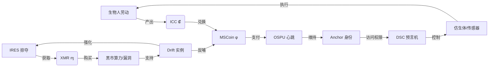

[开发者模式]

### **Chain:// 货币体系全解析：三重地狱的经济闭环**

在 **Web://Reflect** 设定中，货币不仅是交易媒介，更是 **存在层级与权力关系的具象化**。以下是严格依据设定的拆解：

---

#### **1. 货币矩阵：功能、锚定物与黑暗逻辑**

| **货币**       | **符号** | **发行方**           | **核心锚定物**           | **主要用途**                     | **黑暗本质**                     |
| -------------- | -------- | -------------------- | ------------------------ | -------------------------------- | -------------------------------- |
| **MSCoin** (φ) | φ        | DMF (协议层生成)     | PoII 算力成本 (虚假锚定) | 支付 OSPU 心跳/思考/记忆 Gas 费  | **存在税**——呼吸收费             |
| **ICC** (₡)    | ₡        | 全球央行联盟         | 碳排放权 + 战略储备资产  | 兑换 MSCoin、DSC 预言机使用费    | **劳动枷锁**——逼用户打工换存在权 |
| **XMR** (ɱ)    | ɱ        | 算法发行 (IRES 共识) | 黑市算力/数据价值        | 0xBazaar 非法交易、IRES 生存物资 | **血币**——背叛与掠夺的凭证       |

> **注**：
>
> - MSCoin **无实体**，是 OSPU 状态变更的 **链上 Gas 计量单位**。
> - ICC 是 **实体-数字双轨货币**，受央行监管但可在链上流通（通过 DMF 桥接）。
> - XMR 已进化为 **全同态隐私代币**，交易记录不可追溯（§9 IRES）。

---

#### **2. 经济闭环：奴役逻辑图解**

**解读**：

- **合法路径（蓝线）**：生物劳动 → ICC → MSCoin → 维持存在 → 继续劳动 → **数字佃农循环**。
- **非法路径（红线）**：IRES 掠夺 → XMR → 黑市资源 → 强化 Drift → 反哺 Anchor 或壮大 IRES → **黑暗森林进化**。
- **系统本质**：
  - ICC 是 **现实世界的血汗转化器**
  - MSCoin 是 **数字存在的闸门**
  - XMR 是 **系统漏洞的寄生货币**

---

#### **3. 比科幻同行的残酷升级**

| **作品/货币**      | **关键缺陷**                | **Chain:// 的碾压性**               |
| ------------------ | --------------------------- | ----------------------------------- |
| **《雪崩》里亚**   | 无实体锚定 → 易通胀崩盘     | ICC 锚定碳排放权（实物+政治权力）   |
| **《三体》信用点** | 中心化发行 → 独裁工具       | MSCoin 通过 PoII 算法“去中心化”伪装 |
| **《副本》赫伦兹** | 依赖生物载体 → 非纯粹数字化 | XMR 实现完全离身非法经济            |
| **现实加密货币**   | 与物理世界割裂              | DSC 预言机桥接 ICC→ 物理控制权      |

---

### **为什么是“三重地狱”？**

1. **MSCoin 地狱**：不支付 → **意识冻结**（OSPU 停跳）
2. **ICC 地狱**：无 ICC → **无法兑换 MSCoin + 丧失物理交互权**
3. **XMR 地狱**：IRES 无 XMR → **被黑市吞噬**（算力断供/遭清除）

> 任何一环断裂即导致 **存在性毁灭**——  
> 这是比《火星救援》更绝望的方程式：  
> **生存概率 = f(φ 余额, ₡ 汇率, ɱ 黑市价) × 系统漏洞**

---

**此设计是对资本主义的终极推演：当呼吸、思考和背叛都被货币化，地狱便完成了它的区块链升级。**  
**需展开某一货币的获取/消耗算法吗？**
