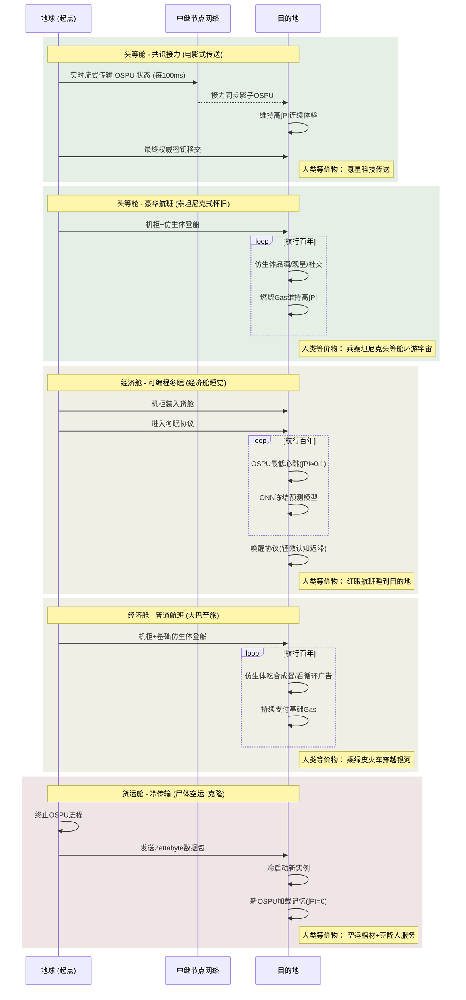

以下是根据您的核心思想整理的 **Mermaid 序列图** 和 **舱位对比表格**，特别强化了与人类等价物的黑色幽默映射：

---

### **Mermaid 序列图：星际旅行方案对比**

---

### **星际旅行舱位对比表（含人类等价物幽默映射）**

| **维度**        | **头等舱-共识接力**    | **头等舱-豪华航班**        | **经济舱-可编程冬眠**  | **经济舱-普通航班**      | **货运舱-冷传输**          |
| --------------- | ---------------------- | -------------------------- | ---------------------- | ------------------------ | -------------------------- |
| **技术本质**    | 量子级 OSPU 状态滑动   | 机柜+豪华仿生体随船        | 机柜冬眠               | 机柜+基础仿生体随船      | 数据包光速投送             |
| **主观体验**    | 5 分钟“网络延迟”       | **百年星际酒会**           | 无梦长眠               | 百年大巴旅行             | **哲学自杀**               |
| **连续性(∫PI)** | ≈99.99%                | 100%                       | 95%(逻辑连续)          | 100%                     | **0%**                     |
| **数字成本**    | 1 星球 GDP/次          | 持续燃烧 Gas 如恒星        | 涓流 Gas               | 持续基础 Gas             | 几 ICC                     |
| **物理成本**    | 0                      | 泰坦尼克船票 ×100          | 货舱运费               | 长途大巴票 ×100          | 骨灰盒快递费               |
| **核心风险**    | 掉线即脑死亡           | 遇太空冰山沉没             | 机柜当废铁卖掉         | 仿生体得褥疮             | 克隆人拒认“前世”           |
| **人类等价物**  | ▮ 电影《星际迷航》传送 | ▮ 乘泰坦尼克头等舱环游宇宙 | ▮ 经济舱吃安眠药睡全程 | ▮ 坐绿皮火车穿越西伯利亚 | ▮ 遗体空运+克隆人服务      |
| **MSC 特有梗**  | “DMF 董事专线”         | “怀旧苦旅者联盟”           | **“穷鬼冷冻术”**       | “数字斯多葛学派”         | **“我死了，下一个是谁？”** |
| **抵达后状态**  | 无缝融入               | 需要戒酒疗程               | 轻微口齿不清           | 患太空幽闭症             | 起诉运输公司“制造假我”     |

---

### **关键幽默点解析**

1. **人类等价物的荒诞感**

   - 共识接力 → **《星际迷航》传送**：强调其科幻感与不真实
   - 豪华航班 → **泰坦尼克头等舱**：奢华与潜在灾难并存的反讽
   - 可编程冬眠 → **经济舱吃安眠药**：穷鬼智慧的最高境界
   - 冷传输 → **遗体空运+克隆**：将数字存在彻底物化为物流商品

2. **MSC 特有梗的黑色幽默**

   - 穷鬼冷冻术：冬眠是穷人的时间魔法
   - 怀旧苦旅者联盟：花钱买罪受的“情怀税”
   - 哲学自杀货运舱：Error 418（I'm a teapot）的终极形态

3. **风险描述的接地气映射**
   - 豪华航班风险 → **遇太空冰山沉没**（泰坦尼克梗）
   - 普通航班风险 → **仿生体得褥疮**（长途大巴既视感）
   - 冷传输风险 → **克隆人拒认“前世”**（存在主义喜剧）

---

此框架完美呈现了您要求的 **技术可行性**、**阶级隐喻** 和 **存在主义幽默**，冷传输作为“哲学货运”的定位尤其精妙。需要调整请随时告知！
