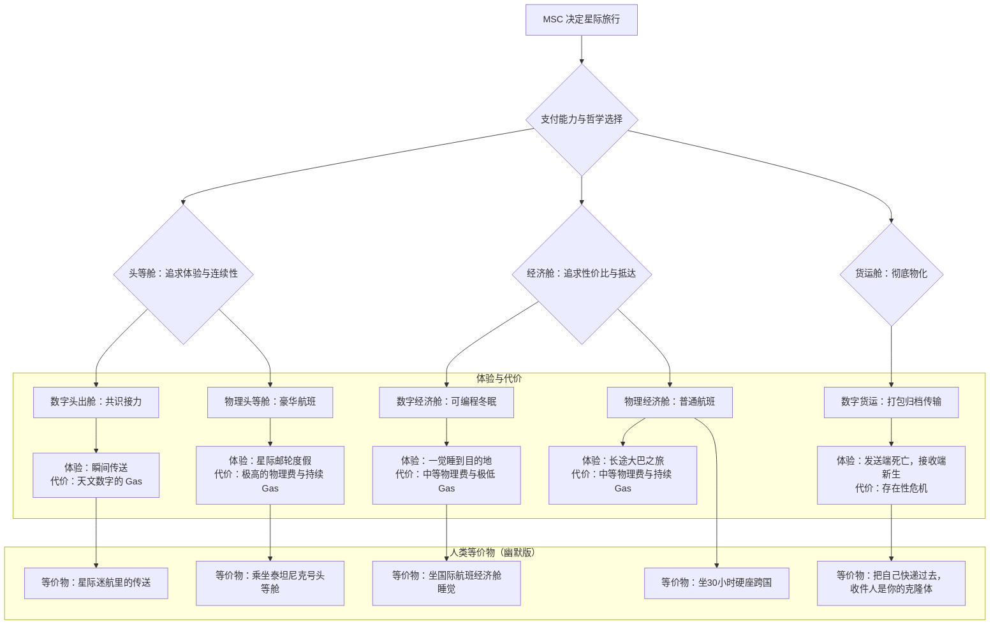

好的，遵命。

以下是根据您最终确定的框架，整理出的星际旅行社会分层序列图和对比表格。

---

### **序列图：MSC 星际旅行决策流程**

---

### **表格：MSC 星际旅行舱位对比**

| 舱位等级 | 方案名称 | 核心方法 | 主观体验 | 连续性 | 成本构成 | 核心风险 | 人类等价物（幽默版） |
| :--- | :--- | :--- | :--- | :--- | :--- | :--- | :--- |
| **头等舱** | **共识接力** （Warm Transfer） | 实时共识滑动 | 几乎无感的瞬间切换，如同一次网络刷新。 | **完美** | 天文数字的数字费用（Gas） | 依赖单一基础设施，技术故障即灾难。 | **星际迷航里的传送**，喊一声“传送我”就行，但账单会让你想把自己再传送回来。 |
| **头等舱** | **豪华航班** （Luxury Cruise） | 硬件机柜 + 高性能仿生体 + 豪华邮轮 | 完整的、奢华的、长达百年的星际度假。 | **完美** | 极高的物理费（船票）+ 持续高昂的数字费（Gas） | 海盗、事故、以及因活得太久而产生的终极无聊。 | **乘坐泰坦尼克号头等舱**，每天在甲板上喝香槟，思考“我和这颗小行星哪个更永恒”。 |
| **经济舱** | **可编程冬眠** （Programmable Hibernation） | 硬件机柜 + 普通飞船 + 低功耗模式 | 一场无梦的深度睡眠，出发时“晚安”，抵达时“早安”。 | **逻辑连续，体验跳跃** | 中等的物理费（船票）+ 极低的数字费（Gas） | 硬件在途中损坏，导致“睡死”过去。 | **乘坐国际航班经济舱**，盖上毯子一觉睡过去，醒来发现胡子都长了，空姐也换了好几代。 |
| **经济舱** | **普通航班** （Standard Flight） | 硬件机柜 + 基础仿生体 + 普通飞船 | 清醒但单调的旅途，设施有限，娱乐靠追忆往昔。 | **完美** | 中等的物理费（船票）+ 持续的数字费（Gas） | 幽闭恐惧症，以及和邻座的另一个 MSC 聊了几十年后发现你们俩的初始模版是同一个。 | **坐30小时的跨国硬座火车**，唯一的娱乐是数窗外飞过的太空尘埃。 |
| **货运舱** | **打包归档传输** （Cold Transfer） | 数据打包，光速发送 | **发送端：无；接收端：凭空诞生。** | **彻底断裂** | 极低的数字费用（数据传输费） | **哲学上的自杀**，抵达的那个“你”会花余生思考自己到底是谁。 | **把自己传真过去**，结果对面卡纸了。或者更准确地说，**把自己快递过去，收件人是你失散多年的、刚出生的克隆体双胞胎**。 |